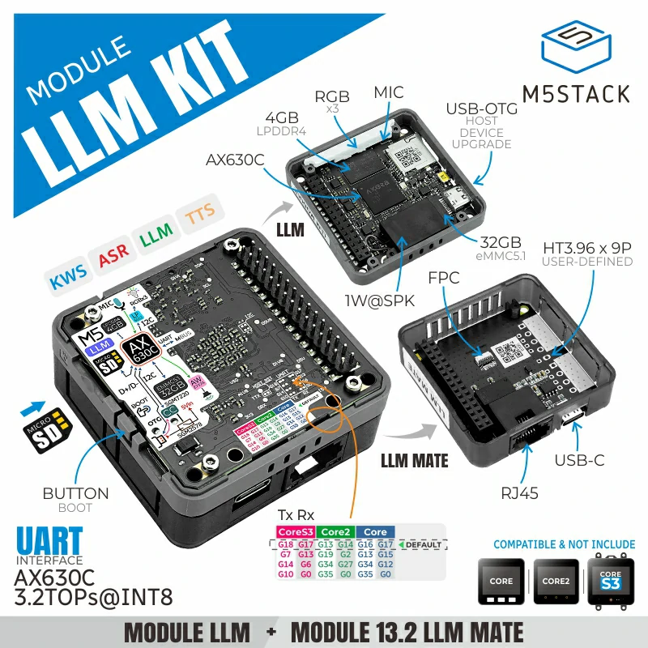

Overview
========

Description
-----------

Module LLM Kit is a smart modular kit focused on offline AI inference and data communication interface applications. It integrates the Module LLM and Module13.2 LLM Mate modules to meet the offline AI inference and data interaction requirements across various scenarios.

Module LLM is an integrated offline large language model (LLM) inference module designed specifically for terminal devices that require efficient and intelligent interaction. Whether for smart home applications, voice assistants, or industrial control, Module LLM delivers a smooth and natural AI experience without relying on the cloud, ensuring privacy, security, and stability.