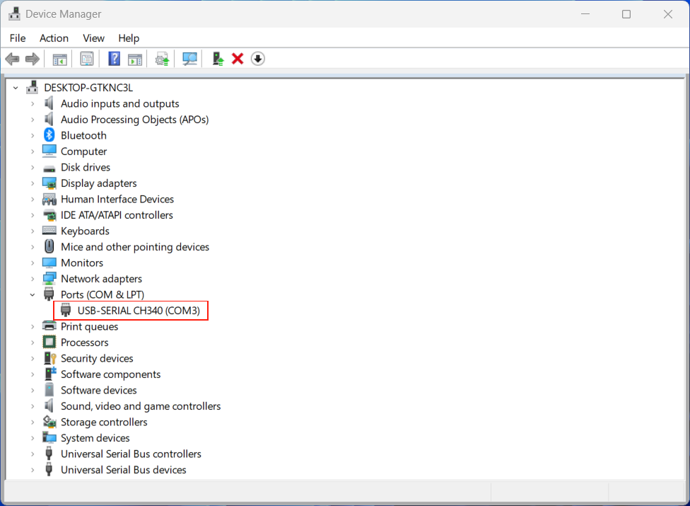

Quickstart
==========

Getting started with your ModuleLLM Kit. Please be sure to follow the steps below in order.

Establish a connection with ModuleLLM
-------------------------------------

.. note::

    The following operations require an internet connection.

    Please ensure that the board is connected to the router via an Ethernet cable, and that the router has enabled DHCP service.

Method 1 Serial Port (UART)
~~~~~~~~~~~~~~~~~~~~~~~~~~~

For Linux host computer
^^^^^^^^^^^^^^^^^^^^^^^

- 1. Connect the debug serial port of the Module LLM Kit in the manner shown in the image below.

- 2. Use the **ls /dev/tty*** command to find the serial port device.

.. code-block:: shell

    ls /dev/tty*

- 3. Use the **screen /dev/ttyUSB0 115200** command to connect to the serial port device.

.. code-block:: shell

    screen /dev/ttyUSB0 115200

.. note::

    The default serial communication baud rate is 115200

    The device name needs to be replaced with your board's name.

- 4. Use the **ip a** command to obtain the board's IP address.

.. code-block:: shell

    ip a

For Windows host computer
^^^^^^^^^^^^^^^^^^^^^^^^^

.. note::

    Please make sure that the driver has been installed.
    `Click here to download <https://www.wch-ic.com/downloads/ch341ser_exe.html>`_.

- 1. Connect the debug serial port of the Module LLM Kit in the manner shown in the image below.

- 2. Open device manager and find the serial port device.

- 3. Use the **PuTTY** software to connect to the serial port device.

- 4. Use the **ip a** command to obtain the board's IP address.

Method 2 Android Debug Bridge (ADB)
~~~~~~~~~~~~~~~~~~~~~~~~~~~~~~~~~~~

For Linux host computer
^^^^^^^^^^^^^^^^^^^^^^^

.. note::

    If you haven't installed ADB tools, please use **sudo apt install adb** command to install first.

    The first time you use it, you need to execute the following command.

    .. code-block:: shell

        sudo sh -c 'echo "SUBSYSTEM==\"usb\", ATTR{idVendor}==\"32c9\", ATTR{idProduct}==\"2003\", GROUP=\"plugdev\", MODE=\"0660\"" > /etc/udev/rules.d/51-android.rules'
        sudo udevadm control --reload-rules
        sudo udevadm trigger
    
- 1. Connect the ADB debug port of the Module LLM Kit in the manner shown in the image below.

- 2. Use the **adb devices** command to get the device list.

.. code-block:: shell

    adb devices

- 3. Use the **adb shell** command to connect to the board.

.. code-block:: shell

    adb shell

.. note::
    If you have multiple devices connected, you can use the **adb -s <device> shell** option to specify the device.
    
- 4. Use the **ip a** command to obtain the board's IP address.

.. code-block:: shell

    ip a

For Windows host computer
^^^^^^^^^^^^^^^^^^^^^^^^^

.. note::

    If you haven't installed ADB tools, please `click here <https://developer.android.com/tools/releases/platform-tools>`_ to install first.

- 1. Connect the ADB debug port of the Module LLM Kit in the manner shown in the image below.

- 2. Use the **adb devices** command to get the device list.

.. code-block:: shell

    adb devices

- 3. Use the **adb shell** command to connect to the board.

.. code-block:: shell

    adb shell

- 4. Use the **ip a** command to obtain the board's IP address.

.. code-block:: shell

    ip a

Method 3 Secure Shell (SSH)
~~~~~~~~~~~~~~~~~~~~~~~~~~~

For Linux host computer
^^^^^^^^^^^^^^^^^^^^^^^

- 1. Use the **ssh root@192.168.20.63** command to connect to the board.

.. code-block:: shell

    ssh root@192.168.20.63

.. note::

    The default password is **123456**

    The IP address needs to be replaced with the IP of your board.

For Windows host computer
^^^^^^^^^^^^^^^^^^^^^^^^^

- 1. Use the **ssh root@192.168.20.63** command to connect to the board.

.. code-block:: shell

    ssh root@192.168.20.74

.. note::

    The default password is **123456**

    The IP address needs to be replaced with the IP of your board.
    

.. _quickstart-software-upgrade:

Software Upgrade
----------------

Download the M5Stack apt repository key and add it to the system
~~~~~~~~~~~~~~~~~~~~~~~~~~~~~~~~~~~~~~~~~~~~~~~~~~~~~~~~~~~~~~~~

.. note::

   This step needs to be performed only once.

.. code-block:: shell

    wget -qO /etc/apt/keyrings/StackFlow.gpg https://repo.llm.m5stack.com/m5stack-apt-repo/key/StackFlow.gpg
    echo 'deb [arch=arm64 signed-by=/etc/apt/keyrings/StackFlow.gpg] https://repo.llm.m5stack.com/m5stack-apt-repo jammy ax630c' > /etc/apt/sources.list.d/StackFlow.list

Get a list of available software
~~~~~~~~~~~~~~~~~~~~~~~~~~~~~~~~

.. code-block:: shell

    apt update

.. code-block:: shell

    apt list | grep llm

Output list
^^^^^^^^^^^

.. code-block:: shell

    llm-asr/stable,now 1.6 arm64 [installed]
    llm-audio/stable 1.6 arm64 [upgradable from: 1.3]
    llm-camera/stable 1.8 arm64 [upgradable from: 1.3]
    llm-depth-anything/stable 1.6 arm64
    llm-kws/stable,now 1.7 arm64 [installed]
    llm-llm/stable,now 1.8 arm64 [installed]
    llm-melotts-zh-cn/now 0.2 arm64 [installed,local]
    llm-melotts/stable,now 1.7 arm64 [installed]
    llm-openai-api/stable,now 1.7 arm64 [installed]
    llm-qwen2.5-0.5b-prefill-20e/now 0.2 arm64 [installed,local]
    llm-single-speaker-english-fast/now 0.2 arm64 [installed,local]
    llm-single-speaker-fast/now 0.2 arm64 [installed,local]
    llm-skel/stable 1.5 arm64 [upgradable from: 1.3]
    llm-sys/stable,now 1.6 arm64 [installed]
    llm-tts/stable 1.6 arm64 [upgradable from: 1.3]
    llm-vad/stable,now 1.6 arm64 [installed]
    llm-vlm/stable 1.7 arm64 [upgradable from: 1.3]
    llm-whisper/stable,now 1.7 arm64 [installed]
    llm-yolo/stable 1.8 arm64 [upgradable from: 1.3]

Get a list of available model
~~~~~~~~~~~~~~~~~~~~~~~~~~~~~

.. code-block:: shell

    apt list | grep llm-model

Output list
^^^^^^^^^^^

.. code-block:: shell

    llm-model-audio-en-us/stable,now 0.2 arm64 [installed]
    llm-model-audio-zh-cn/stable,now 0.2 arm64 [installed]
    llm-model-deepseek-r1-1.5b-ax630c/stable 0.3 arm64
    llm-model-deepseek-r1-1.5b-p256-ax630c/stable 0.4 arm64
    llm-model-depth-anything-ax630c/stable 0.4 arm64
    llm-model-internvl2.5-1b-364-ax630c/stable 0.4 arm64
    llm-model-internvl2.5-1b-ax630c/stable 0.4 arm64
    llm-model-llama3.2-1b-p256-ax630c/stable 0.4 arm64
    llm-model-llama3.2-1b-prefill-ax630c/stable 0.2 arm64
    llm-model-melotts-en-default/stable,now 0.5 arm64 [installed]
    llm-model-melotts-en-us/stable 0.5 arm64
    llm-model-melotts-ja-jp/stable,now 0.5 arm64 [installed]
    llm-model-melotts-zh-cn/stable 0.5 arm64
    llm-model-openbuddy-llama3.2-1b-ax630c/stable 0.2 arm64
    llm-model-qwen2.5-0.5b-int4-ax630c/stable 0.4 arm64
    llm-model-qwen2.5-0.5b-p256-ax630c/stable 0.4 arm64
    llm-model-qwen2.5-0.5b-prefill-20e/stable 0.2 arm64
    llm-model-qwen2.5-1.5b-ax630c/stable 0.3 arm64
    llm-model-qwen2.5-1.5b-int4-ax630c/stable 0.4 arm64
    llm-model-qwen2.5-1.5b-p256-ax630c/stable 0.4 arm64
    llm-model-qwen2.5-coder-0.5b-ax630c/stable 0.2 arm64
    llm-model-qwen3-0.6b-ax630c/stable 0.4 arm64
    llm-model-sherpa-ncnn-streaming-zipformer-20m-2023-02-17/stable,now 0.2 arm64 [installed]
    llm-model-sherpa-ncnn-streaming-zipformer-zh-14m-2023-02-23/stable,now 0.2 arm64 [installed]
    llm-model-sherpa-onnx-kws-zipformer-gigaspeech-3.3m-2024-01-01/stable,now 0.3 arm64 [installed]
    llm-model-sherpa-onnx-kws-zipformer-wenetspeech-3.3m-2024-01-01/stable,now 0.3 arm64 [installed]
    llm-model-silero-vad/stable,now 0.4 arm64 [installed]
    llm-model-single-speaker-english-fast/stable 0.3 arm64
    llm-model-single-speaker-fast/stable 0.3 arm64
    llm-model-smolvlm-256m-ax630c/stable 0.4 arm64
    llm-model-smolvlm-500m-ax630c/stable 0.4 arm64
    llm-model-whisper-base/stable 0.4 arm64
    llm-model-whisper-small/stable 0.4 arm64
    llm-model-whisper-tiny/stable,now 0.4 arm64 [installed]
    llm-model-yolo11n-hand-pose/stable 0.3 arm64
    llm-model-yolo11n-pose/stable,now 0.3 arm64 [installed]
    llm-model-yolo11n-seg/stable,now 0.3 arm64 [installed]
    llm-model-yolo11n/stable,now 0.2 arm64 [installed]

Update the latest software package
~~~~~~~~~~~~~~~~~~~~~~~~~~~~~~~~~~

.. code-block:: shell

    apt install lib-llm llm-sys

Output list
^^^^^^^^^^^

.. code-block:: shell

    root@m5stack-LLM:~# apt install lib-llm llm-sys
    Reading package lists... Done
    Building dependency tree... Done
    Reading state information... Done
    Reinstallation of lib-llm is not possible, it cannot be downloaded.
    The following packages will be upgraded:
    llm-sys
    1 upgraded, 0 newly installed, 0 to remove and 161 not upgraded.
    Need to get 377 kB of archives.
    After this operation, 0 B of additional disk space will be used.
    Do you want to continue? [Y/n] y
    Get:1 https://repo.llm.m5stack.com/m5stack-apt-repo jammy/ax630c arm64 llm-sys arm64 1.6 [377 kB]
    Fetched 377 kB in 2s (224 kB/s)  
    debconf: delaying package configuration, since apt-utils is not installed
    (Reading database ... 60311 files and directories currently installed.)
    Preparing to unpack .../archives/llm-sys_1.6_arm64.deb ...
    Removed /etc/systemd/system/multi-user.target.wants/llm-sys.service.
    Unpacking llm-sys (1.6) over (1.6) ...
    Setting up llm-sys (1.6) ...
    Created symlink /etc/systemd/system/multi-user.target.wants/llm-sys.service → /lib/systemd/system/llm-sys.service.

SD Card Upgrade
---------------

For Linux host computer
~~~~~~~~~~~~~~~~~~~~~~~

- 1. Prepare a 16GB or larger SD card and format it to FAT32.

- 2. Download the latest :doc:`software packages <Software>` and :doc:`model packages <Models>` from the official website.

.. note::

   Always include the latest versions of the **lib-llm** and **llm-sys** packages when performing an upgrade.

- 3. Create a new file named **m5stack_update.config**, and write the name of the software package into it.

- 4. Insert the SD card into the MLLModule KIT.

.. image:: images/quickstart/quickstart_024.gif
   :alt: Example image

.. note::

    During the upgrade process, the LED will flash blue. It will turn green if the upgrade is successful, or red if it fails. You can check the upgrade log in the **m5stack_update.config.update.log** file.

For Windows host computer
~~~~~~~~~~~~~~~~~~~~~~~~~

- 1. Prepare a 16GB or larger SD card and format it to FAT32.

- 2. Download the latest :doc:`software packages <Software>` and :doc:`model packages <Models>` from the official website.

.. note::

   Always include the latest versions of the **lib-llm** and **llm-sys** packages when performing an upgrade.

- 3. Create a new file named **m5stack_update.config**, and write the name of the software package into it.

- 4. Insert the SD card into the MLLModule KIT.

.. image:: images/quickstart/quickstart_024.gif
   :alt: Example image

.. note::

    During the upgrade process, the LED will flash blue. It will turn green if the upgrade is successful, or red if it fails. You can check the upgrade log in the **m5stack_update.config.update.log** file.