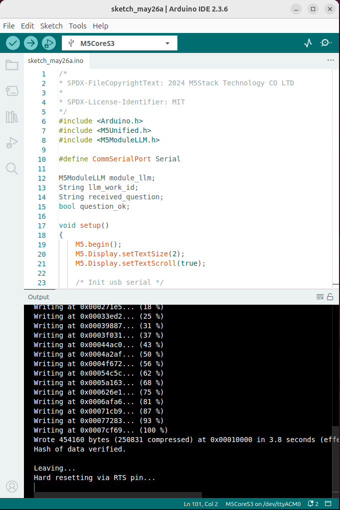
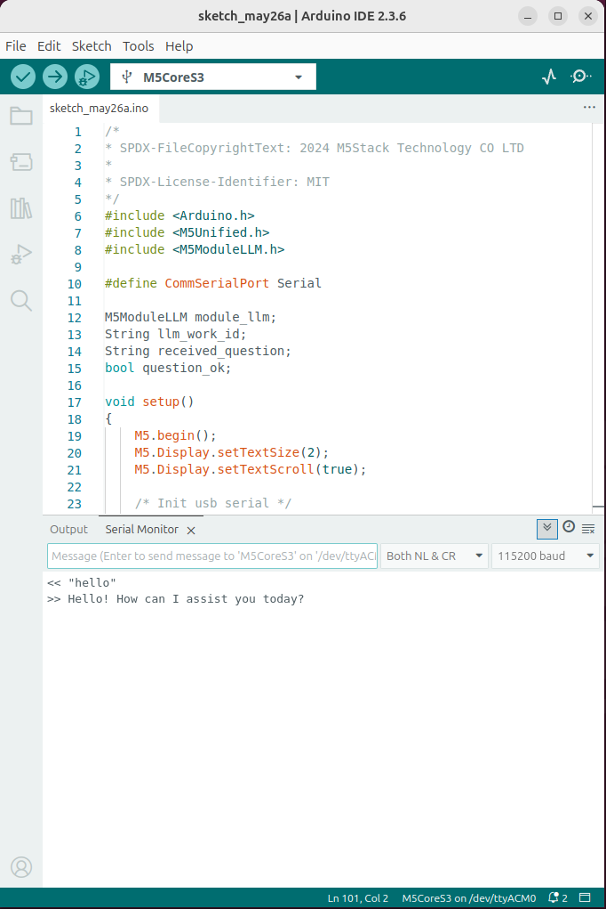
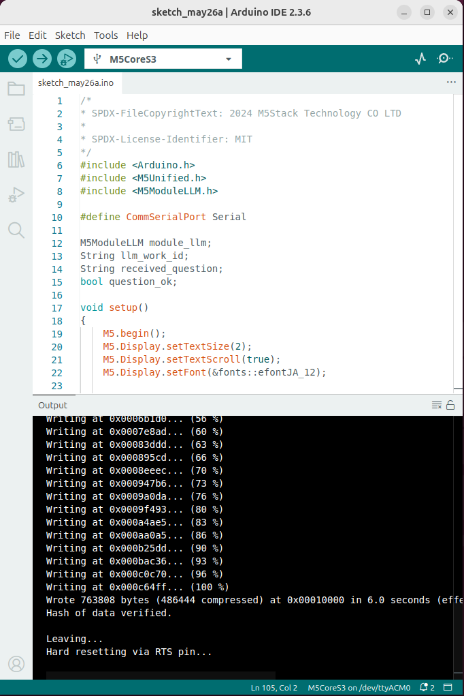
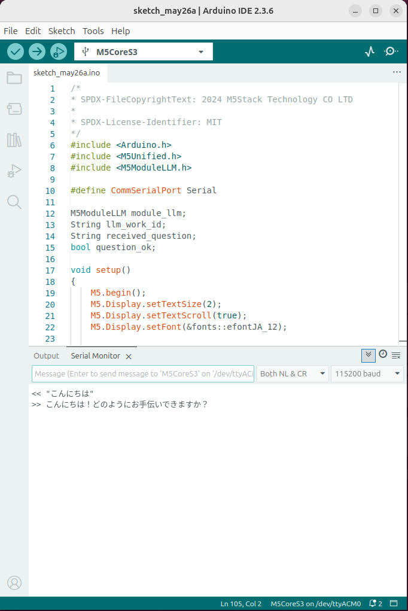

Large Language Model
====================

This example is for the M5Stack Module LLM. It requires the M5Stack Module LLM to be connected to the M5Stack CoreS3, Core2 or Basic.

The example demonstrates how to use the M5ModuleLLM library to send a question to the LLM module and receive a response.

The example uses the USB serial port for communication. You can use any serial terminal program to send questions to the module.

**Before using, make sure you have the latest software packages installed**

.. tip::

    Need help getting started? :ref:`View the tutorial <quickstart-software-upgrade>`.

.. code-block:: shell

    apt install llm-llm

English Example
---------------

**Before using, make sure you have the latest model packages installed**

.. code-block:: shell

    apt install llm-model-qwen2.5-0.5b-prefill-20e

.. tip::

    For more information about this model :ref:`see the details <qwen2.5-0.5b-prefill-20e>`.

Upload code
~~~~~~~~~~~

.. tip::

    How to use this code :ref:`View the tutorial <Upload code>`.

.. code-block:: cpp

    /*
    * SPDX-FileCopyrightText: 2024 M5Stack Technology CO LTD
    *
    * SPDX-License-Identifier: MIT
    */
    #include <Arduino.h>
    #include <M5Unified.h>
    #include <M5ModuleLLM.h>

    #define CommSerialPort Serial

    M5ModuleLLM module_llm;
    String llm_work_id;
    String received_question;
    bool question_ok;

    void setup()
    {
        M5.begin();
        M5.Display.setTextSize(2);
        M5.Display.setTextScroll(true);

        /* Init usb serial */
        CommSerialPort.begin(115200);

        /* Init module serial port */
        int rxd = M5.getPin(m5::pin_name_t::port_c_rxd);
        int txd = M5.getPin(m5::pin_name_t::port_c_txd);
        Serial2.begin(115200, SERIAL_8N1, rxd, txd);

        /* Init module */
        module_llm.begin(&Serial2);

        /* Make sure module is connected */
        M5.Display.printf(">> Check ModuleLLM connection..\n");
        while (1) {
            if (module_llm.checkConnection()) {
                break;
            }
        }

        /* Reset ModuleLLM */
        M5.Display.printf(">> Reset ModuleLLM..\n");
        module_llm.sys.reset();

        /* Setup LLM module and save returned work id */
        M5.Display.printf(">> Setup llm..\n");
        m5_module_llm::ApiLlmSetupConfig_t llm_config;
        llm_config.max_token_len = 1023;
        llm_work_id              = module_llm.llm.setup(llm_config);

        M5.Display.printf(">> Setup finish\n");
        M5.Display.printf(">> Try send your question via usb serial port\n");
        M5.Display.setTextColor(TFT_GREEN);
        M5.Display.printf("e.g. \nHi, What's your name?\n");
        M5.Display.printf("(end with CRLF \\r\\n)\n\n");
    }

    void loop()
    {
        /* Check comm serial port and get received question */
        question_ok = false;
        if (CommSerialPort.available()) {
            while (CommSerialPort.available()) {
                char in_char = (char)CommSerialPort.read();
                received_question += in_char;

                /* Check if question finish */
                if (received_question.endsWith("\r\n")) {
                    received_question.remove(received_question.length() - 2);
                    question_ok = true;
                    break;
                }
            }
        }

        /* If question is ready */
        if (question_ok) {
            M5.Display.setTextColor(TFT_GREEN);
            M5.Display.printf("<< %s\n", received_question.c_str());
            M5.Display.setTextColor(TFT_YELLOW);
            M5.Display.printf(">> ");
            CommSerialPort.printf("<< \"%s\"\n", received_question.c_str());
            CommSerialPort.print(">> ");

            /* Push question to LLM module and wait inference result */
            module_llm.llm.inferenceAndWaitResult(llm_work_id, received_question.c_str(),  {
                /* Show result on screen and usb serial */
                M5.Display.printf("%s", result.c_str());
                CommSerialPort.print(result);
            });

            /* Clear for next question */
            received_question.clear();

            M5.Display.println();
            CommSerialPort.println();
        }

        delay(20);
    }

- 1. Upload the code to the M5Stack CoreS3 or M5Stack Basic.

- 2. Open the Serial Monitor in the Arduino IDE and set the baud rate to 115200. Type a text in the Serial Monitor and press Enter. The M5Stack Module LLM will process the input and return a response.

.. image:: ../images/arduino/llm/arduino_llm_004.png
   :alt: Example image

Japanese Example
----------------

**Before using, make sure you have the latest model packages installed**

.. code-block:: shell

    apt install llm-model-qwen2.5-0.5b-prefill-20e

.. tip::

    For more information about this model :ref:`see the details <qwen2.5-0.5b-prefill-20e>`.

Upload code
~~~~~~~~~~~

.. tip::

    How to use this code :ref:`View the tutorial <Upload code>`.

.. code-block:: cpp

    /*
    * SPDX-FileCopyrightText: 2024 M5Stack Technology CO LTD
    *
    * SPDX-License-Identifier: MIT
    */
    #include <Arduino.h>
    #include <M5Unified.h>
    #include <M5ModuleLLM.h>

    #define CommSerialPort Serial

    M5ModuleLLM module_llm;
    String llm_work_id;
    String received_question;
    bool question_ok;

    void setup()
    {
        M5.begin();
        M5.Display.setTextSize(2);
        M5.Display.setTextScroll(true);
        M5.Display.setFont(&fonts::efontJA_12);

        /* Init usb serial */
        CommSerialPort.begin(115200);

        /* Init module serial port */
        // int rxd = 16, txd = 17;  // Basic
        // int rxd = 13, txd = 14;  // Core2
        // int rxd = 18, txd = 17;  // CoreS3
        int rxd = M5.getPin(m5::pin_name_t::port_c_rxd);
        int txd = M5.getPin(m5::pin_name_t::port_c_txd);
        Serial2.begin(115200, SERIAL_8N1, rxd, txd);

        /* Init module */
        module_llm.begin(&Serial2);

        /* Make sure module is connected */
        M5.Display.printf(">> ModuleLLMの接続を確認しています。\n");
        while (1) {
            if (module_llm.checkConnection()) {
                break;
            }
        }

        /* ModuleLLMをリセット */
        M5.Display.printf(">> ModuleLLMをリセットしています。\n");
        module_llm.sys.reset();

        /* LLMモジュールの設定と返却されたワークIDの保存 */
        M5.Display.printf(">> LLMを設定しています。\n");
        m5_module_llm::ApiLlmSetupConfig_t llm_config;
        llm_config.max_token_len = 1023;
        llm_work_id              = module_llm.llm.setup(llm_config);

        M5.Display.printf(">> 設定が完了しました。\n");
        M5.Display.printf(">> USBシリアルポート経由で質問を送信してください\n");
        M5.Display.setTextColor(TFT_GREEN);
        M5.Display.printf("例:\nHi, What's your name?\n");
        M5.Display.printf("(CRLF \\r\\nで終了)\n\n");
    }

    void loop()
    {
        /* Check comm serial port and get received question */
        question_ok = false;
        if (CommSerialPort.available()) {
            while (CommSerialPort.available()) {
                char in_char = (char)CommSerialPort.read();
                received_question += in_char;

                /* Check if question finish */
                if (received_question.endsWith("\r\n")) {
                    received_question.remove(received_question.length() - 2);
                    question_ok = true;
                    break;
                }
            }
        }

        /* If question is ready */
        if (question_ok) {
            M5.Display.setTextColor(TFT_GREEN);
            M5.Display.printf("<< %s\n", received_question.c_str());
            M5.Display.setTextColor(TFT_YELLOW);
            M5.Display.printf(">> ");
            CommSerialPort.printf("<< \"%s\"\n", received_question.c_str());
            CommSerialPort.print(">> ");

            /* Push question to LLM module and wait inference result */
            module_llm.llm.inferenceAndWaitResult(llm_work_id, received_question.c_str(),  {
                /* Show result on screen and usb serial */
                M5.Display.printf("%s", result.c_str());
                CommSerialPort.print(result);
            });

            /* Clear for next question */
            received_question.clear();

            M5.Display.println();
            CommSerialPort.println();
        }

        delay(20);
    }

- 1. Upload the code to the M5Stack CoreS3 or M5Stack Basic.

- 2. Open the Serial Monitor in the Arduino IDE and set the baud rate to 115200. Type a text in the Serial Monitor and press Enter. The M5Stack Module LLM will process the input and return a response.

.. image:: ../images/arduino/llm/arduino_llm_005.png
   :alt: Example image