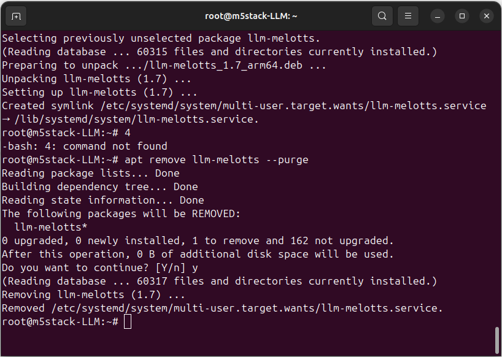
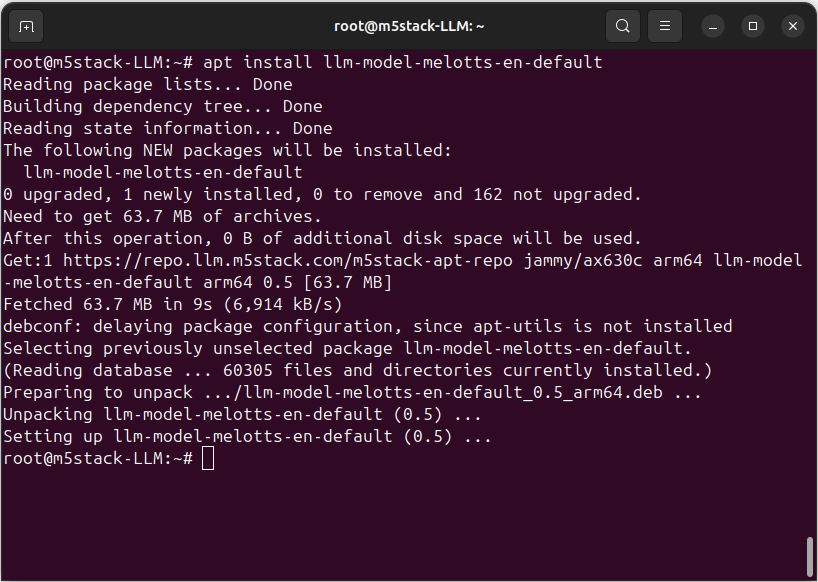
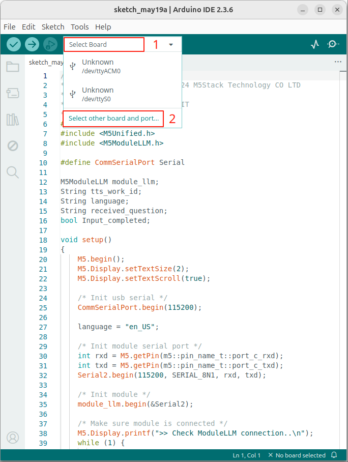
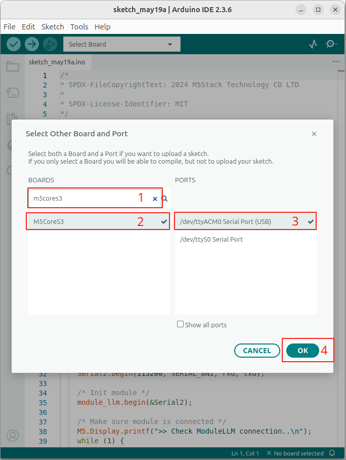
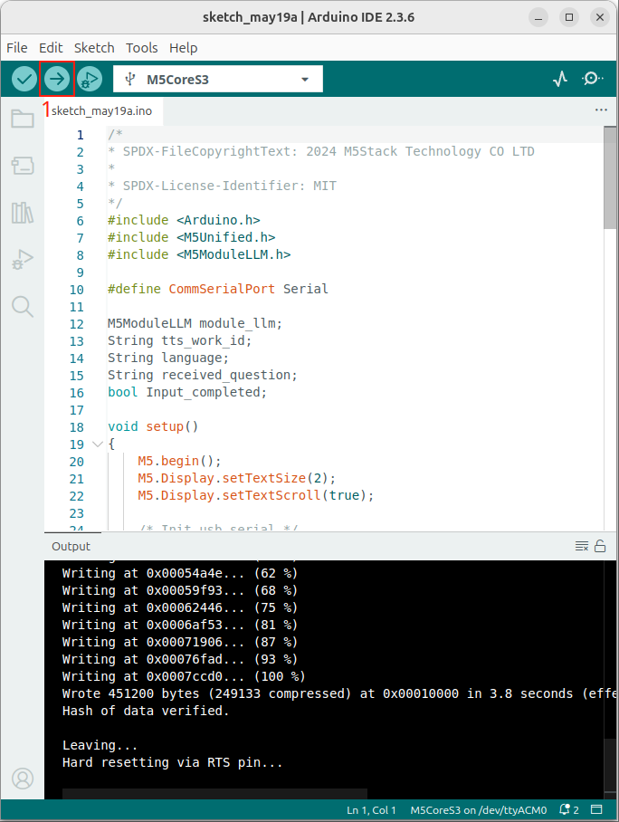
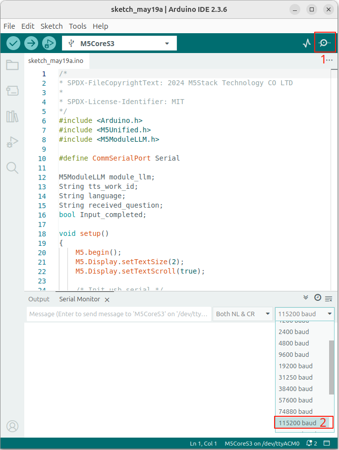
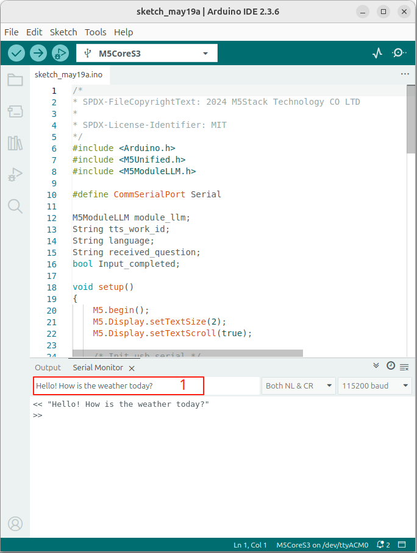
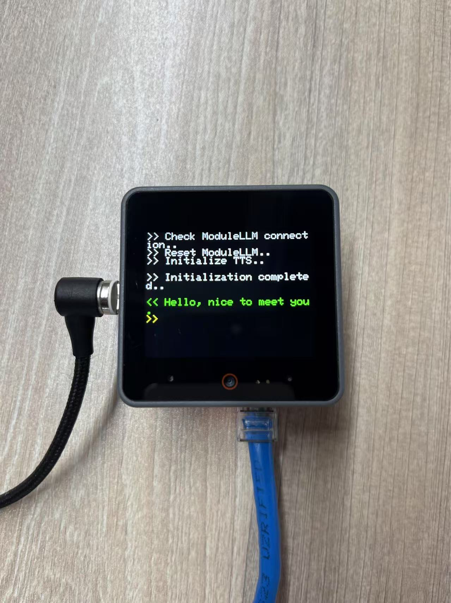
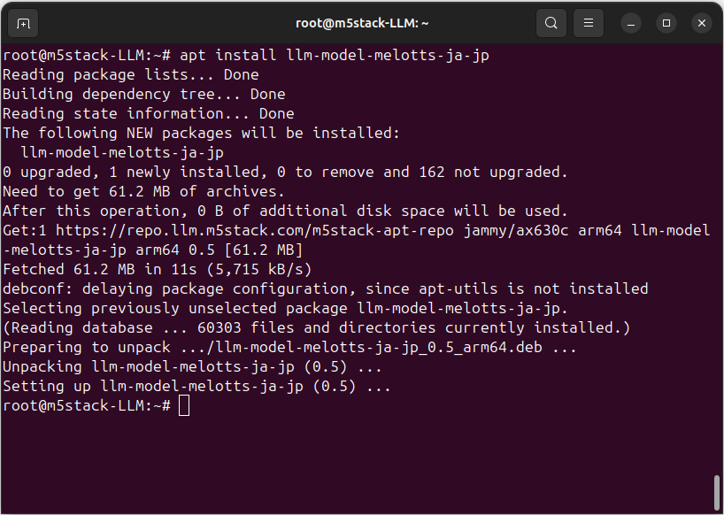
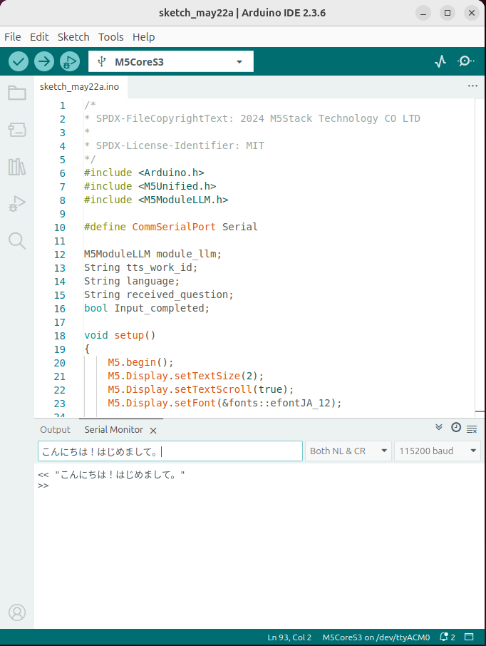

Text-to-Speech
==============

This example is for the M5Stack Module LLM. It requires the M5Stack Module LLM to be connected to the M5Stack CoreS3, Core2 or Basic.

The example demonstrates how to use the M5ModuleLLM library to send a text to the LLM module and play synthesized audio.

The example uses the USB serial port for communication. You can use any serial terminal program to send text to the module.

**Before use, please ensure that you have installed the latest software packages on ModuleLLM.**

.. tip::

    Need help getting started? :ref:`View the tutorial <quickstart-software-upgrade>`.

.. code-block:: shell

    apt install llm-melotts

MeloTTS-English Example
-----------------------

**Before use, please ensure that you have installed the latest software packages on ModuleLLM.**

.. code-block:: shell

    apt install llm-model-melotts-en-default

.. tip::

    For more information about this model :ref:`see the details <melotts-en-default>`.

.. _Upload code:

Upload code
~~~~~~~~~~~

- 1. Connect the M5Stack CoreS3 or M5Stack Basic to your computer.

.. image:: ../images/arduino/text-to-speech/arduino_tts_010.png
   :alt: Example image

- 2. Open the Arduino IDE and select the correct board and port.

- 3. Copy and paste the following code into the Arduino IDE.

.. code-block:: cpp

    /*
    * SPDX-FileCopyrightText: 2024 M5Stack Technology CO LTD
    *
    * SPDX-License-Identifier: MIT
    */
    #include <Arduino.h>
    #include <M5Unified.h>
    #include <M5ModuleLLM.h>

    #define CommSerialPort Serial

    M5ModuleLLM module_llm;
    String tts_work_id;
    String language;
    String received_question;
    bool Input_completed;

    void setup()
    {
        M5.begin();
        M5.Display.setTextSize(2);
        M5.Display.setTextScroll(true);

        /* Init usb serial */
        CommSerialPort.begin(115200);

        language = "en_US";

        /* Init module serial port */
        int rxd = M5.getPin(m5::pin_name_t::port_c_rxd);
        int txd = M5.getPin(m5::pin_name_t::port_c_txd);
        Serial2.begin(115200, SERIAL_8N1, rxd, txd);

        /* Init module */
        module_llm.begin(&Serial2);

        /* Make sure module is connected */
        M5.Display.printf(">> Check ModuleLLM connection..\n");
        while (1) {
            if (module_llm.checkConnection()) {
                break;
            }
        }

        /* Reset ModuleLLM */
        M5.Display.printf(">> Reset ModuleLLM..\n");
        module_llm.sys.reset();

        /* Setup TTS module and save returned work id */
        M5.Display.printf(">> Initialize TTS..\n\n");
        m5_module_llm::ApiMelottsSetupConfig_t melotts_config;
        melotts_config.model = "melotts-en-default";
        tts_work_id          = module_llm.melotts.setup(melotts_config, "tts_setup", language);
        M5.Display.printf(">> Initialization completed..\n\n");
    }

    void loop()
    {
        Input_completed = false;
        if (CommSerialPort.available()) {
            while (CommSerialPort.available()) {
                char in_char = (char)CommSerialPort.read();
                received_question += in_char;

                if (received_question.endsWith("\r\n")) {
                    received_question.remove(received_question.length() - 2);
                    Input_completed = true;
                    break;
                }
            }
        }

        if (Input_completed) {
            /* Push text to TTS module and wait inference result */
            M5.Display.setTextColor(TFT_GREEN);
            M5.Display.printf("<< %s\n", received_question.c_str());
            M5.Display.setTextColor(TFT_YELLOW);
            M5.Display.printf(">> ");
            CommSerialPort.printf("<< \"%s\"\n", received_question.c_str());
            CommSerialPort.print(">> ");

            module_llm.tts.inference(tts_work_id, received_question.c_str(), 10000);

            /* Clear for next question */
            received_question.clear();

            M5.Display.println();
            CommSerialPort.println();
        }

        delay(20);
    }

- 4. Upload the code to the M5Stack CoreS3 or M5Stack Basic.

- 5. Open the Serial Monitor in the Arduino IDE and set the baud rate to 115200.

- 6. Type a text in the Serial Monitor and press Enter.

- 7. The M5Stack Module LLM will synthesize the text and play the audio.

class ApiMelotts
~~~~~~~~~~~~~~~~

.. code-block:: cpp

    struct ApiMelottsSetupConfig_t {
        String model              = "melotts-en-us";
        String response_format    = "sys.pcm";
        std::vector<String> input = {"tts.utf-8.stream"};
        bool enoutput             = false;
        bool enaudio              = true;
    };

- **model**: The model name. You can use "melotts-en-default" for English or "melotts-ja-jp" for Japanese.
- **enoutput**: If true, the TTS module will return the base64 encoding pcm data in utf-8 format.
- **enaudio**: If true, the TTS module will play the synthesized audio.

.. code-block:: cpp

    String setup(ApiMelottsSetupConfig_t config = ApiMelottsSetupConfig_t(), 
                 String request_id = "melotts_setup",
                 String language = "en_US");

- **config**: The configuration for the TTS module. You can use the ApiMelottsSetupConfig_t struct to set the model name and other parameters.
- **request_id**: The request ID for the setup. You can use any string as the request ID.
- **language**: The language for the TTS module. You can use "en_US" for English or "ja_JP" for Japanese.
- **return**: The work ID for the TTS module. You need to use this work ID for the inference function.

.. code-block:: cpp

    int inference(String work_id, String input, uint32_t timeout = 0, String request_id = "tts_inference");

- **work_id**: The work ID for the TTS module. You need to use the work ID returned by the setup function.
- **input**: The text to be synthesized. You can use any string as the input.
- **timeout**: The timeout for the inference. You can use 0 for no timeout.
- **request_id**: The request ID for the inference. You can use any string as the request ID.

MeloTTS-Japanese Example
------------------------

**Before use, please ensure that you have installed the latest software packages on ModuleLLM.**

.. tip::

    For more information about this model :ref:`see the details <melotts-ja-jp>`.

.. code-block:: shell

    apt install llm-model-melotts-ja-jp

Upload code
~~~~~~~~~~~

.. tip::

    How to use this code :ref:`View the tutorial <Upload code>`.

.. code-block:: cpp

    /*
    * SPDX-FileCopyrightText: 2024 M5Stack Technology CO LTD
    *
    * SPDX-License-Identifier: MIT
    */
    #include <Arduino.h>
    #include <M5Unified.h>
    #include <M5ModuleLLM.h>

    #define CommSerialPort Serial

    M5ModuleLLM module_llm;
    String tts_work_id;
    String language;
    String received_question;
    bool Input_completed;

    void setup()
    {
        M5.begin();
        M5.Display.setTextSize(2);
        M5.Display.setTextScroll(true);
        M5.Display.setFont(&fonts::efontJA_12);

        /* Init usb serial */
        CommSerialPort.begin(115200);

        language = "ja_JP";

        /* Init module serial port */
        int rxd = M5.getPin(m5::pin_name_t::port_c_rxd);
        int txd = M5.getPin(m5::pin_name_t::port_c_txd);
        Serial2.begin(115200, SERIAL_8N1, rxd, txd);

        /* Init module */
        module_llm.begin(&Serial2);

        /* Make sure module is connected */
        M5.Display.printf(">> ModuleLLM 接続を確認してください。\n");
        while (1) {
            if (module_llm.checkConnection()) {
                break;
            }
        }

        /* Reset ModuleLLM */
        M5.Display.printf(">> ModuleLLM をリセットします。\n");
        module_llm.sys.reset();

        /* Setup TTS module and save returned work id */
        M5.Display.printf(">> TTS を初期化します。\n\n");
        m5_module_llm::ApiMelottsSetupConfig_t melotts_config;
        melotts_config.model = "melotts-ja-jp";
        tts_work_id          = module_llm.melotts.setup(melotts_config, "tts_setup", language);
        M5.Display.printf(">> 初期化が完了しました。\n\n");
    }

    void loop()
    {
        Input_completed = false;
        if (CommSerialPort.available()) {
            while (CommSerialPort.available()) {
                char in_char = (char)CommSerialPort.read();
                received_question += in_char;

                if (received_question.endsWith("\r\n")) {
                    received_question.remove(received_question.length() - 2);
                    Input_completed = true;
                    break;
                }
            }
        }

        if (Input_completed) {
            /* Push text to TTS module and wait inference result */
            M5.Display.setTextColor(TFT_GREEN);
            M5.Display.printf("<< %s\n", received_question.c_str());
            M5.Display.setTextColor(TFT_YELLOW);
            M5.Display.printf(">> ");
            CommSerialPort.printf("<< \"%s\"\n", received_question.c_str());
            CommSerialPort.print(">> ");

            module_llm.tts.inference(tts_work_id, received_question.c_str(), 10000);

            /* Clear for next question */
            received_question.clear();

            M5.Display.println();
            CommSerialPort.println();
        }

        delay(20);
    }

.. image:: ../images/arduino/text-to-speech/arduino_tts_012.png
   :alt: Example image