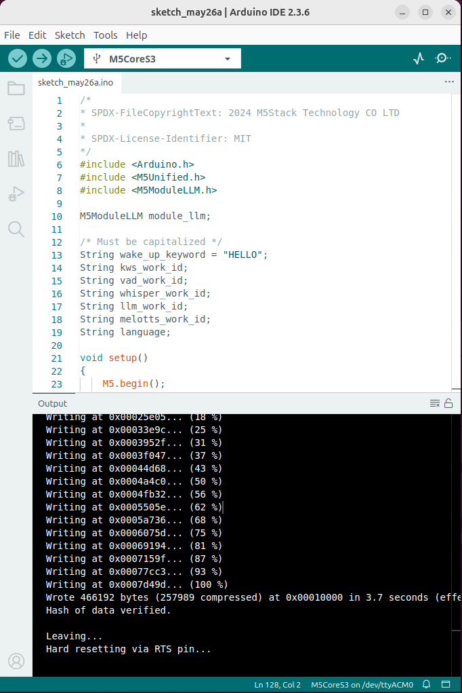
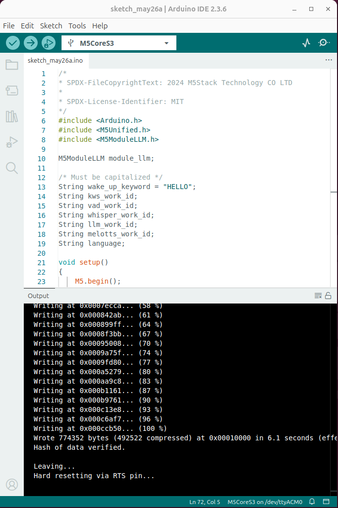

Voice Assistant
===============

This example is for the M5Stack Module LLM. It requires the M5Stack Module LLM to be connected to the M5Stack CoreS3, Core2 or Basic.

The example demonstrates how to use the M5ModuleLLM library to implement a voice assistant.

**Before using, make sure you have the latest software packages installed**

.. tip::

    Need help getting started? :ref:`View the tutorial <quickstart-software-upgrade>`.

.. code-block:: shell

    apt install llm-whisper llm-kws llm-vad llm-llm llm-melotts

English Example
---------------

**Before using, make sure you have the latest model packages installed**

.. code-block:: shell

    apt install llm-model-whisper-tiny llm-model-silero-vad llm-model-sherpa-onnx-kws-zipformer-gigaspeech-3.3m-2024-01-01 llm-model-melotts-en-default

Upload code
~~~~~~~~~~~

.. tip::

    How to use this code :ref:`View the tutorial <Upload code>`.

.. code-block:: cpp

    /*
    * SPDX-FileCopyrightText: 2024 M5Stack Technology CO LTD
    *
    * SPDX-License-Identifier: MIT
    */
    #include <Arduino.h>
    #include <M5Unified.h>
    #include <M5ModuleLLM.h>

    M5ModuleLLM module_llm;

    /* Must be capitalized */
    String wake_up_keyword = "HELLO";
    String kws_work_id;
    String vad_work_id;
    String whisper_work_id;
    String llm_work_id;
    String melotts_work_id;
    String language;

    void setup()
    {
        M5.begin();
        M5.Display.setTextSize(2);
        M5.Display.setTextScroll(true);

        language = "en_US";

        /* Init module serial port */
        int rxd = M5.getPin(m5::pin_name_t::port_c_rxd);
        int txd = M5.getPin(m5::pin_name_t::port_c_txd);
        Serial2.begin(115200, SERIAL_8N1, rxd, txd);

        /* Init module */
        module_llm.begin(&Serial2);

        /* Make sure module is connected */
        M5.Display.printf(">> Check ModuleLLM connection..\n");
        while (1) {
            if (module_llm.checkConnection()) {
                break;
            }
        }

        /* Reset ModuleLLM */
        M5.Display.printf(">> Reset ModuleLLM..\n");
        module_llm.sys.reset();

        /* Setup KWS module and save returned work id */
        M5.Display.printf(">> Setup kws..\n");
        m5_module_llm::ApiKwsSetupConfig_t kws_config;
        kws_config.kws = wake_up_keyword;
        kws_work_id    = module_llm.kws.setup(kws_config, "kws_setup", language);

        /* Setup VAD module and save returned work id */
        M5.Display.printf(">> Setup vad..\n");
        m5_module_llm::ApiVadSetupConfig_t vad_config;
        vad_config.input = {"sys.pcm", kws_work_id};
        vad_work_id      = module_llm.vad.setup(vad_config, "vad_setup");

        /* Setup Whisper module and save returned work id */
        M5.Display.printf(">> Setup whisper..\n");
        m5_module_llm::ApiWhisperSetupConfig_t whisper_config;
        whisper_config.input    = {"sys.pcm", kws_work_id, vad_work_id};
        whisper_config.language = "en";
        whisper_work_id = module_llm.whisper.setup(whisper_config, "whisper_setup");

        M5.Display.printf(">> Setup llm..\n");
        llm_work_id = module_llm.llm.setup();

        M5.Display.printf(">> Setup melotts..\n\n");
        m5_module_llm::ApiMelottsSetupConfig_t melotts_config;
        melotts_config.model = "melotts-en-default";
        melotts_config.input = {"tts.utf-8.stream", llm_work_id, kws_work_id};
        melotts_work_id      = module_llm.melotts.setup(melotts_config, "melotts_setup");

        M5.Display.printf(">> Setup ok\n>> Say \"%s\" to wakeup\n", wake_up_keyword.c_str());
    }

    void loop()
    {
        /* Update ModuleLLM */
        module_llm.update();

        /* Handle module response messages */
        for (auto& msg : module_llm.msg.responseMsgList) {
            /* If KWS module message */
            if (msg.work_id == kws_work_id) {
                M5.Display.setTextColor(TFT_GREENYELLOW);
                M5.Display.printf(">> Keyword detected\n");
            }

            if (msg.work_id == vad_work_id) {
                M5.Display.setTextColor(TFT_GREENYELLOW);
                M5.Display.printf(">> vad detected\n");
            }
            /* If ASR module message */
            if (msg.work_id == whisper_work_id) {
                /* Check message object type */
                if (msg.object == "asr.utf-8") {
                    /* Parse message json and get ASR result */
                    JsonDocument doc;
                    deserializeJson(doc, msg.raw_msg);
                    String asr_result = doc["data"].as<String>();

                    M5.Display.setTextColor(TFT_YELLOW);
                    M5.Display.printf(">> %s\n", asr_result.c_str());

                    module_llm.llm.inferenceAndWaitResult(llm_work_id, asr_result.c_str(),  {
                        /* Show result on screen */
                        handleLLMResult(result);
                    });
                }
            }
        }

        /* Clear handled messages */
        module_llm.msg.responseMsgList.clear();
    }

    void handleLLMResult(String& result)
    {
        M5.Display.printf("%s", result.c_str());
    }

- 1. Upload the code to the M5Stack CoreS3 or M5Stack Basic.

- 2. Wait for initialization to complete and display **Say "hello" to wakeup**

.. image:: ../images/arduino/voice_assistant/arduino_voice_assistant_001.png
   :alt: Example image

- 3. Say "hello" to wake up the voice assistant, It will display **keyword detected**.

.. image:: ../images/arduino/voice_assistant/arduino_voice_assistant_002.png
   :alt: Example image

- 4. After the wake word is detected, you can ask questions, and the voice assistant will respond with the answer.

.. image:: ../images/arduino/voice_assistant/arduino_voice_assistant_003.png
   :alt: Example image

.. image:: ../images/arduino/voice_assistant/arduino_voice_assistant_004.png
   :alt: Example image

Japanese Example
----------------

**Before using, make sure you have the latest model packages installed**

.. code-block:: shell

    apt install llm-model-whisper-tiny llm-model-silero-vad llm-model-sherpa-onnx-kws-zipformer-gigaspeech-3.3m-2024-01-01 llm-model-melotts-ja-jp

Upload code
~~~~~~~~~~~

.. tip::

    How to use this code :ref:`View the tutorial <Upload code>`.

.. code-block:: cpp

    /*
    * SPDX-FileCopyrightText: 2024 M5Stack Technology CO LTD
    *
    * SPDX-License-Identifier: MIT
    */
    #include <Arduino.h>
    #include <M5Unified.h>
    #include <M5ModuleLLM.h>

    M5ModuleLLM module_llm;

    /* Must be capitalized */
    String wake_up_keyword = "HELLO";
    String kws_work_id;
    String vad_work_id;
    String whisper_work_id;
    String llm_work_id;
    String melotts_work_id;
    String language;

    void setup()
    {
        M5.begin();
        M5.Display.setTextSize(2);
        M5.Display.setTextScroll(true);
        M5.Display.setFont(&fonts::efontJA_12);

        language = "en_US";

        /* Init module serial port */
        int rxd = M5.getPin(m5::pin_name_t::port_c_rxd);
        int txd = M5.getPin(m5::pin_name_t::port_c_txd);
        Serial2.begin(115200, SERIAL_8N1, rxd, txd);

        /* Init module */
        module_llm.begin(&Serial2);

        /* Make sure module is connected */
        M5.Display.printf(">> ModuleLLM 接続を確認してください。\n");
        while (1) {
            if (module_llm.checkConnection()) {
                break;
            }
        }

        /* Reset ModuleLLM */
        M5.Display.printf(">> ModuleLLMをリセットしています。\n");
        module_llm.sys.reset();

        /* Setup KWS module and save returned work id */
        M5.Display.printf(">> KWSを設定しています。\n");
        m5_module_llm::ApiKwsSetupConfig_t kws_config;
        kws_config.kws = wake_up_keyword;
        kws_work_id    = module_llm.kws.setup(kws_config, "kws_setup", language);

        /* Setup VAD module and save returned work id */
        M5.Display.printf(">> VADを設定しています。\n");
        m5_module_llm::ApiVadSetupConfig_t vad_config;
        vad_config.input = {"sys.pcm", kws_work_id};
        vad_work_id      = module_llm.vad.setup(vad_config, "vad_setup");

        /* Setup Whisper module and save returned work id */
        M5.Display.printf(">> Whisperを設定しています。\n");
        m5_module_llm::ApiWhisperSetupConfig_t whisper_config;
        whisper_config.input    = {"sys.pcm", kws_work_id, vad_work_id};
        whisper_config.language = "ja";
        whisper_work_id = module_llm.whisper.setup(whisper_config, "whisper_setup");

        M5.Display.printf(">> LLMを設定しています。\n");
        llm_work_id = module_llm.llm.setup();

        M5.Display.printf(">> melottsを設定しています。\n\n");
        m5_module_llm::ApiMelottsSetupConfig_t melotts_config;
        melotts_config.model = "melotts-ja-jp";
        melotts_config.input = {"tts.utf-8.stream", llm_work_id, kws_work_id};
        melotts_work_id      = module_llm.melotts.setup(melotts_config, "melotts_setup");

        M5.Display.printf(">> 設定が完了しました。\n>> \"%s\"と発言してください", wake_up_keyword.c_str());
    }

    void loop()
    {
        /* Update ModuleLLM */
        module_llm.update();

        /* Handle module response messages */
        for (auto& msg : module_llm.msg.responseMsgList) {
            /* If KWS module message */
            if (msg.work_id == kws_work_id) {
                M5.Display.setTextColor(TFT_GREENYELLOW);
                M5.Display.printf(">> Keyword detected\n");
            }

            if (msg.work_id == vad_work_id) {
                M5.Display.setTextColor(TFT_GREENYELLOW);
                M5.Display.printf(">> vad detected\n");
            }
            /* If ASR module message */
            if (msg.work_id == whisper_work_id) {
                /* Check message object type */
                if (msg.object == "asr.utf-8") {
                    /* Parse message json and get ASR result */
                    JsonDocument doc;
                    deserializeJson(doc, msg.raw_msg);
                    String asr_result = doc["data"].as<String>();

                    M5.Display.setTextColor(TFT_YELLOW);
                    M5.Display.printf(">> %s\n", asr_result.c_str());

                    module_llm.llm.inferenceAndWaitResult(llm_work_id, asr_result.c_str(),  {
                        /* Show result on screen */
                        handleLLMResult(result);
                    });
                }
            }
        }

        /* Clear handled messages */
        module_llm.msg.responseMsgList.clear();
    }

    void handleLLMResult(String& result)
    {
        M5.Display.printf("%s", result.c_str());
    }

- 1. Upload the code to the M5Stack CoreS3 or M5Stack Basic.

- 2. Wait for initialization to complete and display **Say "hello" to wakeup**

.. image:: ../images/arduino/voice_assistant/arduino_voice_assistant_006.png
   :alt: Example image

- 3. Say "hello" to wake up the voice assistant, It will display **keyword detected**. After the wake word is detected, you can ask questions, and the voice assistant will respond with the answer.

.. image:: ../images/arduino/voice_assistant/arduino_voice_assistant_007.png
   :alt: Example image