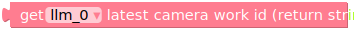

API reference
=============

This section provides a reference for the UiFlow API used in the examples. It includes details on the functions, classes, and methods available for use in your UiFlow projects.

LlmModule
----------

class LlmModule
~~~~~~~~~~~~~~~

Initialize LlmModule and set up UART communication based on board type.

methods
~~~~~~~

Update ModuleLLM, receive response message.

Check if the module connection is working properly.

- **return**: True if the connection is connected, False otherwise.
- **type**: bool

- **return**: Models installed on ModuleLLM.
- **type**: str

Get the message list of the latest response from ModuleLLM.

- **return**: The latest work ID of the LLM module.
- **type**: str

- **return**: The latest work ID of the MeloTTS module.
- **type**: str

- **return**: The latest work ID of the KWS module.
- **type**: str

.. image:: ../images/uiflow2/api/uiflow2_block_1748404189168.svg
   :alt: Example image

- **return**: The latest work ID of the ASR module.
- **type**: str

- **return**: The latest work ID of the camera module.
- **type**: str

- **return**: The latest work ID of the YOLO module.
- **type**: str

- **return**: The latest work ID of the VAD module.
- **type**: str

- **return**: The latest work ID of the Whisper module.
- **type**: str

- **return**: The latest error code of the LLM module.
- **type**: str

Send a ping to the system and get the response code.

Reset the ModuleLLM and clear all work IDs.

Remove the model on ModuleLLM.

Reboot the ModuleLLM.

Clear the response message list.

Keyword Spotting
----------------

KWS block
~~~~~~~~~

.. code-block:: python

    llm_0.kws_setup(kws='HI JIMMY', model='sherpa-onnx-kws-zipformer-gigaspeech-3.3M-2024-01-01', enoutput=True, enaudio=True, request_id='kws_setup')

- **kws**: The wake-up keyword to listen for. Must be capitalized.
- **model**: Default is **sherpa-onnx-kws-zipformer-gigaspeech-3.3M-2024-01-01** for English. see the available models: :ref:`sherpa-onnx-kws-zipformer <kws_models>`.
- **enoutput**: Enables output of the keyword spotting results.
- **enoutput**: If true, the KWS module will return the boolean result in the response. Default is **true**.
- **enaudio**: If true, the KWS module will play the wake-up audio. Default is **true**.
- **request_id**: The request ID for the setup. You can use any string as the request ID.

Voice activity detection
------------------------

VAD block
~~~~~~~~~
.. image:: ../images/uiflow2/api/uiflow2_block_1748400451912.svg
   :alt: Example image

.. code-block:: python

    llm_0.vad_setup(model='silero-vad', enoutput=True, enkws='', request_id='vad_setup')

- **model**: The model name for voice activity detection. Default is **silero-vad**. see the available models: :ref:`silero-vad <vad_models>`.
- **enoutput**: If true, the VAD module will return the boolean result in the response. Default is true.
- **enkws**: The work ID of the latest KWS module. Default is an empty string.
- **request_id**: The request ID for the setup. You can use any string as the request ID.

Automatic Speech Recognition
----------------------------

ASR block
~~~~~~~~~

.. code-block:: python

    llm_0.asr_setup(model='sherpa-ncnn-streaming-zipformer-20M-2023-02-17', enoutput=True, enkws='', rule1=2.4, rule2=1.2, rule3=30, request_id='asr_setup')

- **model**: The model name for automatic speech recognition. Default is **sherpa-ncnn-streaming-zipformer-20M-2023-02-17** for English. see the available models: :ref:`sherpa-ncnn-streaming-zipformer <asr_models>`.
- **enoutput**: If true, the ASR module will return the recognized text in the response. Default is true.
- **enkws**: The work ID of the latest KWS module. Default is an empty string.
- **rule1**: Times out after **2.4** seconds of silence, even if we decoded nothing.
- **rule2**: Times out after **1.2** seconds of silence after decoding something.
- **rule3**: Times out after the utterance is **30** seconds long, regardless of anything else.
- **request_id**: The request ID for the setup. You can use any string as the request ID.

Transcription
-------------

Whisper block
~~~~~~~~~~~~~

.. code-block:: python

    llm_0.whisper_setup(model='whisper-tiny', enoutput=True, language='en', enkws='', envad='', request_id='whisper_setup')

- **model**: The model name. default is **whisper-tiny**. You can use **whisper-base** or **whisper-small** for larger models. see the available models: :ref:`whisper-tiny <whisper-tiny_model>` | :ref:`whisper-base <whisper-base_model>` | :ref:`whisper-small <whisper-small_model>`
- **language**: The language for the Whisper module. You can use **en** for English or **ja** for Japanese.
- **enkws**: The work ID of the latest KWS module. Default is an empty string.
- **envad**: The work ID of the latest VAD module. Default is an empty string.
- **request_id**: The request ID for the setup. You can use any string as the request ID.

Text-to-speech
--------------

MeloTTS block
~~~~~~~~~~~~~

.. code-block:: python

    llm_0.melotts_setup(model='melotts-en-default', input='tts.utf-8.stream', enoutput=False, enkws='', request_id='melotts_setup')

- **model**: The model name. You can use **melotts-en-default** for English or **melotts-ja-jp** for Japanese. see the available models: :ref:`English <melotts-en>` | :ref:`Japanese <melotts-ja>` | :ref:`Chinese <melotts-zh>`.
- **input**: The input format for the TTS module. You can use **tts.utf-8.stream** for UTF-8 encoded text streaming input.
- **enoutput**: If true, the TTS module will return the base64 encoding pcm data in utf-8 format. Default is **false**.
- **enkws**: The work ID of the latest KWS module. Default is an empty string.
- **request_id**: The request ID for the setup. You can use any string as the request ID.

.. code-block:: python

    llm_0.melotts_inference(llm_0.get_latest_melotts_work_id(), 'tts_text', 10000, 'melotts_inference')

- **work_id**: The work ID for the TTS module. You need to use `llm_0.get_latest_melotts_work_id()` to get the latest work ID.
- **input**: The text to be synthesized. You can use any string as the input.
- **timeout**: Wait response timeout, default **10000ms** (do not wait response)
- **request_id**: The request ID for the inference. You can use any string as the request ID.

Large Language Model
--------------------

Yolo block
~~~~~~~~~~

.. code-block:: python

    llm_0.llm_setup(prompt='You are a helpful assistant.', model='qwen2.5-0.5B-prefill-20e', enoutput=True, enkws='', max_token_len=127, request_id='llm_setup')

- **prompt**: The system prompt for the LLM. Default is **You are a helpful assistant.**.
- **model**: The model name. You can use **qwen2.5-0.5B-prefill-20e** for the Qwen2.5 model. see the available models: :ref:`Reasoning models <Reasoning_models>` | :ref:`Flagship chat models <Flagship_chat_models>`
- **enoutput**: If true, the LLM module will return the response in the response message. Default is **true**.
- **enkws**: The work ID of the latest KWS module. Default is an empty string.
- **max_token_len**: The maximum token length for the LLM response. Default is **127**.
- **request_id**: The request ID for the setup. You can use any string as the request ID.

.. code-block:: python

  llm_0.llm_inference(llm_0.get_latest_llm_work_id(), 'Can I ask you a question?', 'llm_inference')

- **work_id**: The work ID for the LLM module. You need to use `llm_0.get_latest_llm_work_id()` to get the latest work ID.
- **input**: The input text for the LLM. You can use any string as the input.
- **request_id**: The request ID for the inference. You can use any string as the request ID.

Vision
------

Yolo block
~~~~~~~~~~

.. code-block:: python

    llm_0.yolo_setup(model='yolo11n', enoutput=True, input='', request_id='yolo_setup')

- **model**: The model name for object detection. Default is **yolo11n**. see the available models: :ref:`yolo11n <yolo_models>`.
- **enoutput**: If true, the Yolo module will return the detection results in the response. Default is **true**.
- **input**: The input format for the Yolo module. Default is an empty string.
- **request_id**: The request ID for the setup. You can use any string as the request ID.

Peripherals
-----------

Camera block
~~~~~~~~~~~~

.. Note::
    To use this module, you need to connect the USB Camera to ModuleLLM

.. code-block:: python

    llm_0.camera_setup(input='/dev/video0', frame_width=320, frame_height=320, request_id='camera_setup', enoutput=False)

- **input**: The input device for the camera. Default is **/dev/video0**.
- **frame_width**: The width of the camera frame. Default is **320**.
- **frame_height**: The height of the camera frame. Default is **320**.
- **request_id**: The request ID for the camera setup. You can use any string as the request ID.