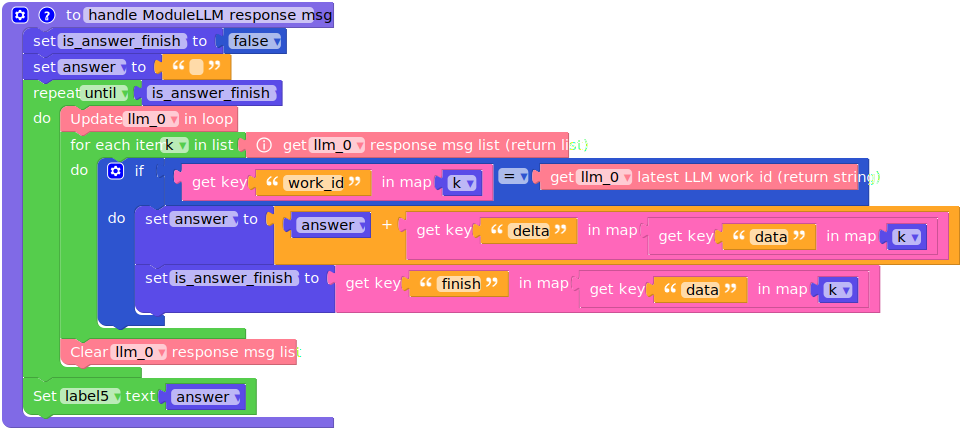

Large Language Model
====================

This example is for the M5Stack Module LLM. It requires the M5Stack Module LLM to be connected to the M5Stack CoreS3, Core2 or Basic.

**Before using, make sure you have the latest software packages installed**

.. tip::

    Need help getting started? :ref:`View the tutorial <quickstart-software-upgrade>`.

.. code-block:: shell

    apt install llm-llm

UIFLOW2 Example
---------------

**Before using, make sure you have the latest model packages installed**

.. code-block:: shell

    apt install llm-model-qwen2.5-0.5b-prefill-20e

.. tip::

    For more information about this model :ref:`see the details <qwen2.5-0.5b-prefill-20e>`.

**Click here to jump to** `llm demo <https://uiflow2.m5stack.com/?pkey=167c2996558d421eb8826f92d79239e6>`_ 

.. image:: ../images/uiflow2/llm/uiflow2_llm_000.png
   :alt: Example image

Micropython Example
-------------------

**Before using, make sure you have the latest model packages installed**

.. code-block:: shell

    apt install llm-model-qwen2.5-0.5b-prefill-20e

.. tip::

    For more information about this model :ref:`see the details <qwen2.5-0.5b-prefill-20e>`.

.. code-block:: python

    import os, sys, io
    import M5
    from M5 import *
    from module import LlmModule
    import time

    label0 = None
    label1 = None
    label2 = None
    label3 = None
    label4 = None
    label5 = None
    llm_0 = None

    adding_number = None
    is_answer_finish = None
    question = None
    answer = None
    k = None

    # Describe this function...
    def handle_ask_question():
        global adding_number, is_answer_finish, question, answer, k, label0, label1, label2, label3, label4, label5, llm_0
        adding_number = adding_number + 1
        question = 'What is x + x equal to?'.replace('x', str(adding_number))
        label3.setText(str(question))
        llm_0.llm_inference(llm_0.get_latest_llm_work_id(), question, 'llm_inference')

    # Describe this function...
    def handle_ModuleLLM_response_msg():
        global adding_number, is_answer_finish, question, answer, k, label0, label1, label2, label3, label4, label5, llm_0
        is_answer_finish = False
        answer = ''
        while not is_answer_finish:
            llm_0.update()
            for k in (llm_0.get_response_msg_list()):
                if (k['work_id']) == (llm_0.get_latest_llm_work_id()):
                    answer = (str(answer) + str(((k['data'])['delta'])))
                    is_answer_finish = (k['data'])['finish']
            llm_0.clear_response_msg_list()
        label5.setText(str(answer))

    def setup():
        global label0, label1, label2, label3, label4, label5, llm_0, adding_number, is_answer_finish, question, answer, k

        M5.begin()
        Widgets.fillScreen(0x222222)
        label0 = Widgets.Label("State", 10, 10, 1.0, 0xffffff, 0x222222, Widgets.FONTS.DejaVu18)
        label1 = Widgets.Label("~", 10, 40, 1.0, 0xffffff, 0x222222, Widgets.FONTS.DejaVu18)
        label2 = Widgets.Label("Question", 10, 70, 1.0, 0xffffff, 0x222222, Widgets.FONTS.DejaVu18)
        label3 = Widgets.Label("~", 10, 100, 1.0, 0xffffff, 0x222222, Widgets.FONTS.DejaVu18)
        label4 = Widgets.Label("Answer", 10, 130, 1.0, 0xffffff, 0x222222, Widgets.FONTS.DejaVu18)
        label5 = Widgets.Label("~", 10, 160, 1.0, 0xffffff, 0x222222, Widgets.FONTS.DejaVu18)

        llm_0 = LlmModule(2, tx=17, rx=18)
        label1.setText(str('Wait ModuleLLM connection..'))
        while not (llm_0.check_connection()):
            time.sleep(1)
        label1.setText(str('Reset ModuleLLM..'))
        llm_0.sys_reset(True)
        label1.setText(str('Setup LLM module..'))
        llm_0.llm_setup(prompt='You are a helpful assistant.', model='qwen2.5-0.5B-prefill-20e', enoutput=True, enkws='', max_token_len=127, request_id='llm_setup')
        adding_number = 0
        label1.setText(str('OK'))

    def loop():
        global label0, label1, label2, label3, label4, label5, llm_0, adding_number, is_answer_finish, question, answer, k
        handle_ask_question()
        handle_ModuleLLM_response_msg()
        time.sleep(1)

    if __name__ == '__main__':
        try:
            setup()
            while True:
                loop()
        except (Exception, KeyboardInterrupt) as e:
            try:
                from utility import print_error_msg
                print_error_msg(e)
            except ImportError:
                print("please update to latest firmware")