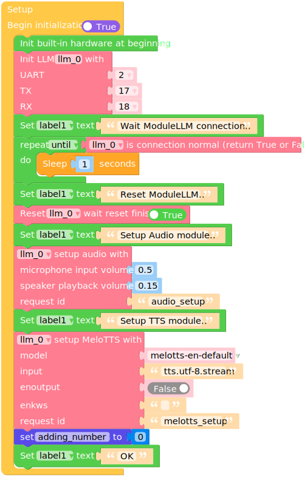
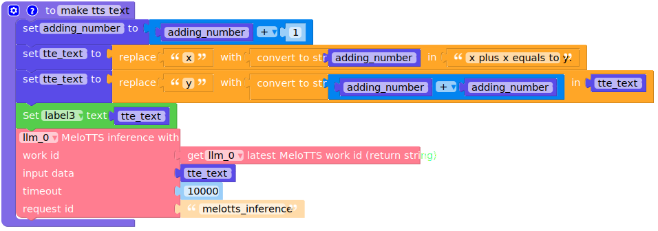
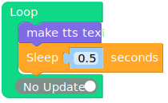
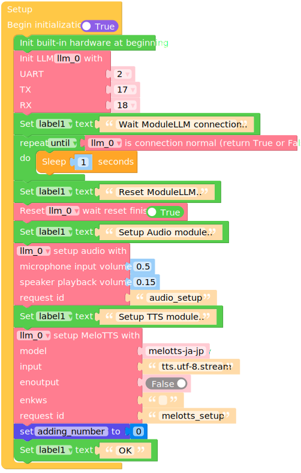
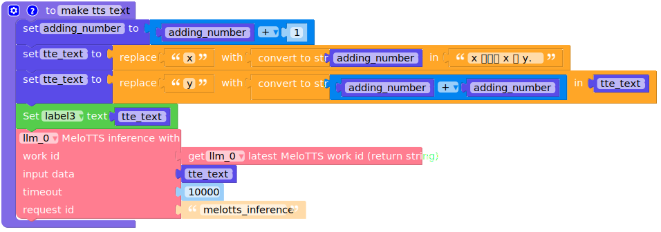

Text-to-Speech
==============

**Before using, make sure you have the latest software packages installed**

.. code-block:: shell

    apt install llm-melotts

Micropython English Example
---------------------------

**Before using, make sure you have the latest model packages installed**

.. code-block:: shell

    apt install llm-model-melotts-en-default

.. code-block:: python

    import os, sys, io
    import M5
    from M5 import *
    from module import LlmModule
    import time

    label0 = None
    label1 = None
    label2 = None
    label3 = None
    llm_0 = None

    adding_number = None
    tte_text = None

    # Describe this function...
    def make_tts_text():
        global adding_number, tte_text, label0, label1, label2, label3, llm_0
        adding_number = adding_number + 1
        tte_text = 'x plus x equals to y.'.replace('x', str(adding_number))
        tte_text = tte_text.replace('y', str((adding_number + adding_number)))
        label3.setText(str(tte_text))
        llm_0.tts_inference(llm_0.get_latest_melotts_work_id(), tte_text, 10000, 'melotts_inference')

    def setup():
        global label0, label1, label2, label3, llm_0, adding_number, tte_text

        M5.begin()
        Widgets.fillScreen(0x222222)
        label0 = Widgets.Label("State", 10, 10, 1.0, 0xffffff, 0x222222, Widgets.FONTS.DejaVu18)
        label1 = Widgets.Label("~", 10, 40, 1.0, 0xffffff, 0x222222, Widgets.FONTS.DejaVu18)
        label2 = Widgets.Label("TTS text:", 10, 70, 1.0, 0xffffff, 0x222222, Widgets.FONTS.DejaVu18)
        label3 = Widgets.Label("~", 10, 100, 1.0, 0xffffff, 0x222222, Widgets.FONTS.DejaVu18)

        llm_0 = LlmModule(2, tx=17, rx=18)
        label1.setText(str('Wait ModuleLLM connection..'))
        while not (llm_0.check_connection()):
            time.sleep(1)
        label1.setText(str('Reset ModuleLLM..'))
        llm_0.sys_reset(True)
        label1.setText(str('Setup Audio module..'))
        llm_0.audio_setup(cap_volume=0.5, play_volume=0.15, request_id='audio_setup')
        label1.setText(str('Setup TTS module..'))
        llm_0.melotts_setup(model='melotts-en-default', input='tts.utf-8.stream', enoutput=False, enkws='', request_id='melotts_setup')
        adding_number = 0
        label1.setText(str('OK'))

    def loop():
        global label0, label1, label2, label3, llm_0, adding_number, tte_text
        make_tts_text()
        time.sleep(0.5)

    if __name__ == '__main__':
        try:
            setup()
            while True:
                loop()
        except (Exception, KeyboardInterrupt) as e:
            try:
                from utility import print_error_msg
                print_error_msg(e)
            except ImportError:
                print("please update to latest firmware")

UIFLOW2 English Example
-----------------------

**Before using, make sure you have the latest model packages installed**

.. code-block:: shell

    apt install llm-model-melotts-en-default

Micropython Japanese Example
----------------------------

**Before using, make sure you have the latest model packages installed**

.. code-block:: shell

    apt install llm-model-melotts-ja-jp

.. code-block:: python

    import os, sys, io
    import M5
    from M5 import *
    from module import LlmModule
    import time

    label0 = None
    label1 = None
    label2 = None
    label3 = None
    llm_0 = None

    adding_number = None
    tte_text = None

    # Describe this function...
    def make_tts_text():
        global adding_number, tte_text, label0, label1, label2, label3, llm_0
        adding_number = adding_number + 1
        tte_text = 'x プラス x は y.'.replace('x', str(adding_number))
        tte_text = tte_text.replace('y', str((adding_number + adding_number)))
        label3.setText(str(tte_text))
        llm_0.melotts_inference(llm_0.get_latest_melotts_work_id(), tte_text, 10000, 'melotts_inference')

    def setup():
        global label0, label1, label2, label3, llm_0, adding_number, tte_text

        M5.begin()
        Widgets.fillScreen(0x222222)
        label0 = Widgets.Label("State", 10, 10, 1.0, 0xffffff, 0x222222, Widgets.FONTS.DejaVu18)
        label1 = Widgets.Label("~", 10, 40, 1.0, 0xffffff, 0x222222, Widgets.FONTS.DejaVu18)
        label2 = Widgets.Label("TTS text:", 10, 70, 1.0, 0xffffff, 0x222222, Widgets.FONTS.DejaVu18)
        label3 = Widgets.Label("~", 10, 100, 1.0, 0xffffff, 0x222222, Widgets.FONTS.EFontJA24)

        llm_0 = LlmModule(2, tx=17, rx=18)
        label1.setText(str('Wait ModuleLLM connection..'))
        while not (llm_0.check_connection()):
            time.sleep(1)
        label1.setText(str('Reset ModuleLLM..'))
        llm_0.sys_reset(True)
        label1.setText(str('Setup Audio module..'))
        llm_0.audio_setup(cap_volume=0.5, play_volume=0.15, request_id='audio_setup')
        label1.setText(str('Setup TTS module..'))
        llm_0.melotts_setup(model='melotts-ja-jp', input='tts.utf-8.stream', enoutput=False, enkws='', request_id='melotts_setup')
        adding_number = 0
        label1.setText(str('OK'))

    def loop():
        global label0, label1, label2, label3, llm_0, adding_number, tte_text
        make_tts_text()
        time.sleep(0.5)

    if __name__ == '__main__':
        try:
            setup()
            while True:
                loop()
        except (Exception, KeyboardInterrupt) as e:
            try:
                from utility import print_error_msg
                print_error_msg(e)
            except ImportError:
                print("please update to latest firmware")

UIFLOW2 Japanese Example
------------------------

**Before using, make sure you have the latest model packages installed**

.. code-block:: shell

    apt install llm-model-melotts-ja-jp

