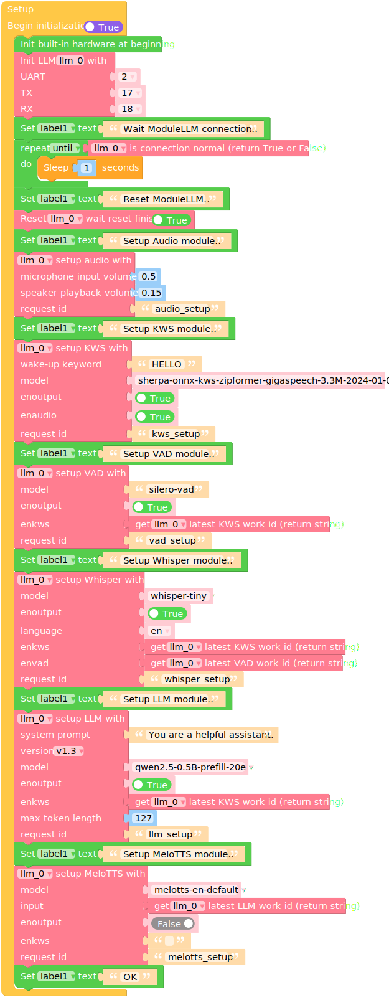
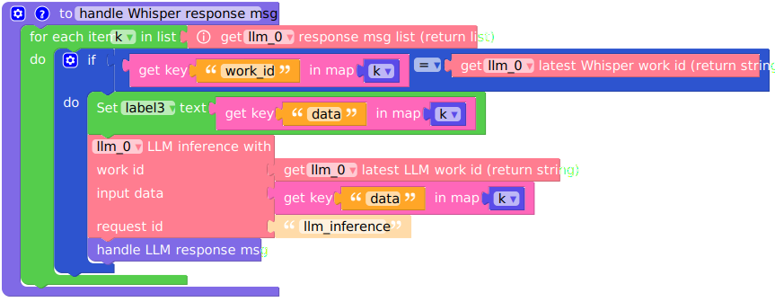
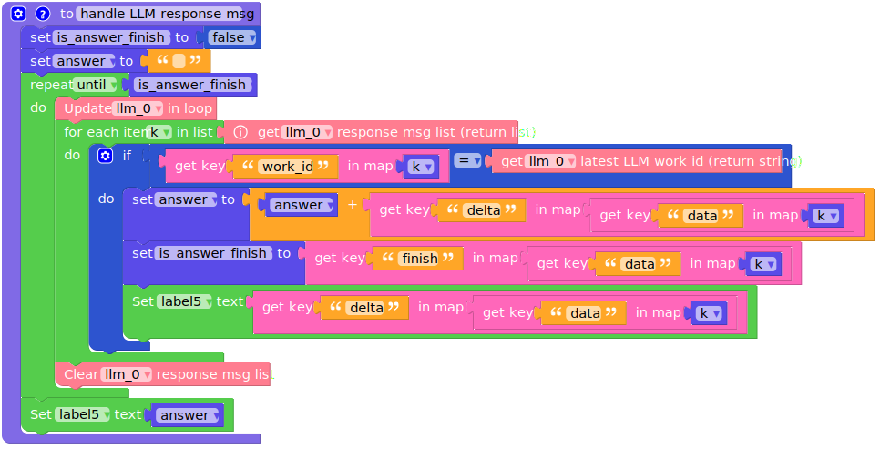
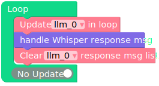
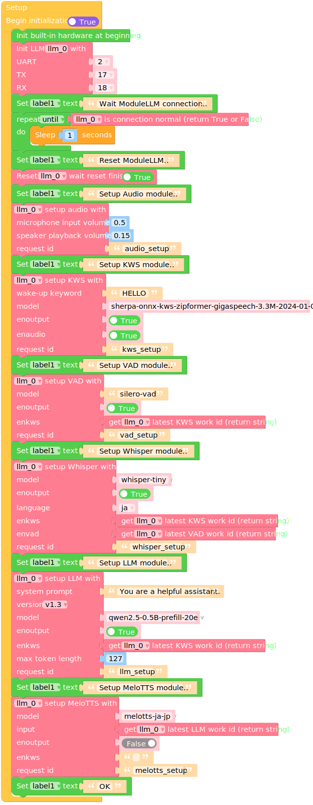

Voice Assistant
===============

**Before using, make sure you have the latest software packages installed**

.. code-block:: shell

    apt install llm-whisper llm-kws llm-vad llm-llm llm-melotts

Micropython English Example
---------------------------

**Before using, make sure you have the latest model packages installed**

.. code-block:: shell

    apt install llm-model-whisper-tiny llm-model-silero-vad llm-model-sherpa-onnx-kws-zipformer-gigaspeech-3.3m-2024-01-01 llm-model-melotts-en-default

.. code-block:: python

    import os, sys, io
    import M5
    from M5 import *
    from module import LlmModule
    import time

    label0 = None
    label4 = None
    label1 = None
    label5 = None
    label2 = None
    label3 = None
    llm_0 = None

    k = None
    is_answer_finish = None
    answer = None

    # Describe this function...
    def handle_Whisper_response_msg():
        global k, is_answer_finish, answer, label0, label4, label1, label5, label2, label3, llm_0
        for k in (llm_0.get_response_msg_list()):
            if (k['work_id']) == (llm_0.get_latest_whisper_work_id()):
                label3.setText(str(k['data']))
                llm_0.llm_inference(llm_0.get_latest_llm_work_id(), k['data'], 'llm_inference')
                handle_LLM_response_msg()

    # Describe this function...
    def handle_LLM_response_msg():
        global k, is_answer_finish, answer, label0, label4, label1, label5, label2, label3, llm_0
        is_answer_finish = False
        answer = ''
        while not is_answer_finish:
            llm_0.update()
            for k in (llm_0.get_response_msg_list()):
                if (k['work_id']) == (llm_0.get_latest_llm_work_id()):
                    answer = (str(answer) + str(((k['data'])['delta'])))
                    is_answer_finish = (k['data'])['finish']
                    label5.setText(str((k['data'])['delta']))
                llm_0.clear_response_msg_list()
        label5.setText(str(answer))

    def setup():
        global label0, label4, label1, label5, label2, label3, llm_0, is_answer_finish, answer, k

        M5.begin()
        Widgets.fillScreen(0x222222)
        label0 = Widgets.Label("State", 10, 20, 1.0, 0xffffff, 0x222222, Widgets.FONTS.DejaVu18)
        label4 = Widgets.Label("LLM output data:", 10, 140, 1.0, 0xffffff, 0x222222, Widgets.FONTS.DejaVu18)
        label1 = Widgets.Label("~", 10, 50, 1.0, 0xffffff, 0x222222, Widgets.FONTS.DejaVu18)
        label5 = Widgets.Label("~", 10, 170, 1.0, 0xffffff, 0x222222, Widgets.FONTS.DejaVu18)
        label2 = Widgets.Label("ASR input data:", 10, 80, 1.0, 0xffffff, 0x222222, Widgets.FONTS.DejaVu18)
        label3 = Widgets.Label("~", 10, 109, 1.0, 0xffffff, 0x222222, Widgets.FONTS.EFontJA24)

        llm_0 = LlmModule(2, tx=17, rx=18)
        label1.setText(str('Wait ModuleLLM connection..'))
        while not (llm_0.check_connection()):
            time.sleep(1)
        label1.setText(str('Reset ModuleLLM..'))
        llm_0.sys_reset(True)
        label1.setText(str('Setup Audio module..'))
        llm_0.audio_setup(cap_volume=0.5, play_volume=0.15, request_id='audio_setup')
        label1.setText(str('Setup KWS module..'))
        llm_0.kws_setup(kws='HELLO', model='sherpa-onnx-kws-zipformer-gigaspeech-3.3M-2024-01-01', enoutput=True, enaudio=True, request_id='kws_setup')
        label1.setText(str('Setup VAD module..'))
        llm_0.vad_setup(model='silero-vad', enoutput=True, enkws=llm_0.get_latest_kws_work_id(), request_id='vad_setup')
        label1.setText(str('Setup Whisper module..'))
        llm_0.whisper_setup(model='whisper-tiny', enoutput=True, language='en', enkws=llm_0.get_latest_kws_work_id(), envad=llm_0.get_latest_vad_work_id(), request_id='whisper_setup')
        label1.setText(str('Setup LLM module..'))
        llm_0.llm_setup(prompt='You are a helpful assistant.', model='qwen2.5-0.5B-prefill-20e', enoutput=True, enkws=llm_0.get_latest_kws_work_id(), max_token_len=127, request_id='llm_setup')
        label1.setText(str('Setup MeloTTS module..'))
        llm_0.melotts_setup(model='melotts-en-default', input=llm_0.get_latest_llm_work_id(), enoutput=False, enkws='', request_id='melotts_setup')
        label1.setText(str('OK'))

    def loop():
        global label0, label4, label1, label5, label2, label3, llm_0, is_answer_finish, answer, k
        llm_0.update()
        handle_Whisper_response_msg()
        llm_0.clear_response_msg_list()

    if __name__ == '__main__':
        try:
            setup()
            while True:
                loop()
        except (Exception, KeyboardInterrupt) as e:
            try:
                from utility import print_error_msg
                print_error_msg(e)
            except ImportError:
                print("please update to latest firmware")

UIFLOW2 English Example
-----------------------

**Before using, make sure you have the latest model packages installed**

.. code-block:: shell

    apt install llm-model-whisper-tiny llm-model-silero-vad llm-model-sherpa-onnx-kws-zipformer-gigaspeech-3.3m-2024-01-01 llm-model-melotts-en-default

Micropython Japanese Example
----------------------------

**Before using, make sure you have the latest model packages installed**

.. code-block:: shell

    apt install llm-model-whisper-tiny llm-model-silero-vad llm-model-sherpa-onnx-kws-zipformer-gigaspeech-3.3m-2024-01-01 llm-model-melotts-ja-jp

.. code-block:: python

    import os, sys, io
    import M5
    from M5 import *
    from module import LlmModule
    import time

    label0 = None
    label4 = None
    label1 = None
    label5 = None
    label2 = None
    label3 = None
    llm_0 = None

    k = None
    is_answer_finish = None
    answer = None

    # Describe this function...
    def handle_Whisper_response_msg():
        global k, is_answer_finish, answer, label0, label4, label1, label5, label2, label3, llm_0
        for k in (llm_0.get_response_msg_list()):
            if (k['work_id']) == (llm_0.get_latest_whisper_work_id()):
                label3.setText(str(k['data']))
                llm_0.llm_inference(llm_0.get_latest_llm_work_id(), k['data'], 'llm_inference')
                handle_LLM_response_msg()

    # Describe this function...
    def handle_LLM_response_msg():
        global k, is_answer_finish, answer, label0, label4, label1, label5, label2, label3, llm_0
        is_answer_finish = False
        answer = ''
        while not is_answer_finish:
            llm_0.update()
            for k in (llm_0.get_response_msg_list()):
                if (k['work_id']) == (llm_0.get_latest_llm_work_id()):
                    answer = (str(answer) + str(((k['data'])['delta'])))
                    is_answer_finish = (k['data'])['finish']
                    label5.setText(str((k['data'])['delta']))
                llm_0.clear_response_msg_list()
        label5.setText(str(answer))

    def setup():
        global label0, label4, label1, label5, label2, label3, llm_0, is_answer_finish, answer, k

        M5.begin()
        Widgets.fillScreen(0x222222)
        label0 = Widgets.Label("State", 10, 20, 1.0, 0xffffff, 0x222222, Widgets.FONTS.DejaVu18)
        label4 = Widgets.Label("LLM output data:", 10, 140, 1.0, 0xffffff, 0x222222, Widgets.FONTS.DejaVu18)
        label1 = Widgets.Label("~", 10, 50, 1.0, 0xffffff, 0x222222, Widgets.FONTS.DejaVu18)
        label5 = Widgets.Label("~", 10, 170, 1.0, 0xffffff, 0x222222, Widgets.FONTS.DejaVu18)
        label2 = Widgets.Label("ASR input data:", 10, 80, 1.0, 0xffffff, 0x222222, Widgets.FONTS.DejaVu18)
        label3 = Widgets.Label("~", 10, 109, 1.0, 0xffffff, 0x222222, Widgets.FONTS.EFontJA24)

        llm_0 = LlmModule(2, tx=17, rx=18)
        label1.setText(str('Wait ModuleLLM connection..'))
        while not (llm_0.check_connection()):
            time.sleep(1)
        label1.setText(str('Reset ModuleLLM..'))
        llm_0.sys_reset(True)
        label1.setText(str('Setup Audio module..'))
        llm_0.audio_setup(cap_volume=0.5, play_volume=0.15, request_id='audio_setup')
        label1.setText(str('Setup KWS module..'))
        llm_0.kws_setup(kws='HELLO', model='sherpa-onnx-kws-zipformer-gigaspeech-3.3M-2024-01-01', enoutput=True, enaudio=True, request_id='kws_setup')
        label1.setText(str('Setup VAD module..'))
        llm_0.vad_setup(model='silero-vad', enoutput=True, enkws=llm_0.get_latest_kws_work_id(), request_id='vad_setup')
        label1.setText(str('Setup Whisper module..'))
        llm_0.whisper_setup(model='whisper-tiny', enoutput=True, language='ja', enkws=llm_0.get_latest_kws_work_id(), envad=llm_0.get_latest_vad_work_id(), request_id='whisper_setup')
        label1.setText(str('Setup LLM module..'))
        llm_0.llm_setup(prompt='You are a helpful assistant.', model='qwen2.5-0.5B-prefill-20e', enoutput=True, enkws=llm_0.get_latest_kws_work_id(), max_token_len=127, request_id='llm_setup')
        label1.setText(str('Setup MeloTTS module..'))
        llm_0.melotts_setup(model='melotts-ja-jp', input=llm_0.get_latest_llm_work_id(), enoutput=False, enkws='', request_id='melotts_setup')
        label1.setText(str('OK'))

    def loop():
        global label0, label4, label1, label5, label2, label3, llm_0, is_answer_finish, answer, k
        llm_0.update()
        handle_Whisper_response_msg()
        llm_0.clear_response_msg_list()

    if __name__ == '__main__':
        try:
            setup()
            while True:
                loop()
        except (Exception, KeyboardInterrupt) as e:
            try:
                from utility import print_error_msg
                print_error_msg(e)
            except ImportError:
                print("please update to latest firmware")

UIFLOW2 Japanese Example
------------------------

**Before using, make sure you have the latest model packages installed**

.. code-block:: shell

    apt install llm-model-whisper-tiny llm-model-silero-vad llm-model-sherpa-onnx-kws-zipformer-gigaspeech-3.3m-2024-01-01 llm-model-melotts-ja-jp

