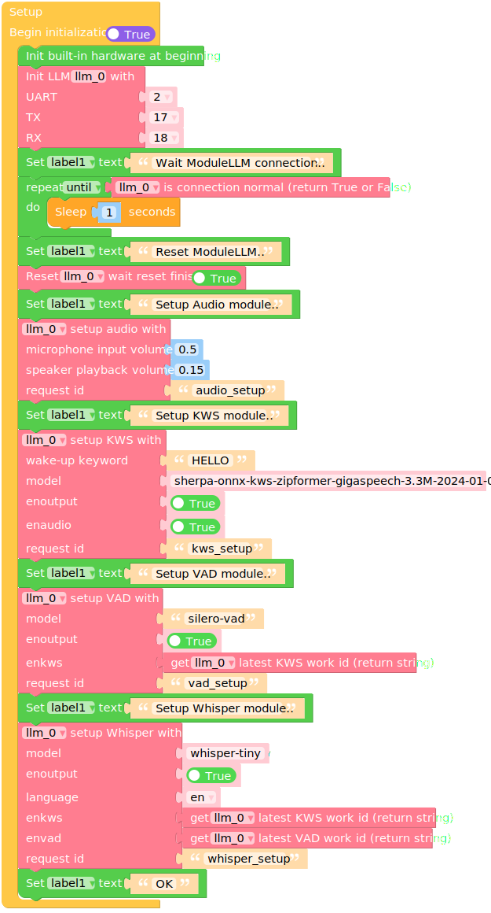
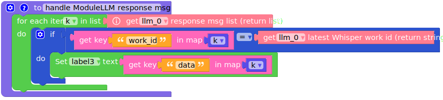
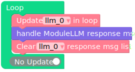

whisper
=======

This example is for the M5Stack Module LLM. It requires the M5Stack Module LLM to be connected to the M5Stack CoreS3, Core2 or Basic.

The example demonstrates how to use the M5ModuleLLM library to perform keyword spotting (KWS), voice activity detection (VAD), and automatic speech recognition (ASR) using the Whisper model.

**Before using, make sure you have the latest software packages installed**

.. tip::

    Need help getting started? :ref:`View the tutorial <quickstart-software-upgrade>`.

.. code-block:: shell

    apt install llm-whisper llm-kws llm-vad

UIFLOW2 English Example
-----------------------

**Before using, make sure you have the latest model packages installed**

.. code-block:: shell

    apt install llm-model-whisper-tiny llm-model-silero-vad llm-model-sherpa-onnx-kws-zipformer-gigaspeech-3.3m-2024-01-01

.. tip::

    For more information about this model :ref:`see the details <whisper-tiny_model>`.

Micropython English Example
---------------------------

**Before using, make sure you have the latest model packages installed**

.. code-block:: shell

    apt install llm-model-whisper-tiny llm-model-silero-vad llm-model-sherpa-onnx-kws-zipformer-gigaspeech-3.3m-2024-01-01

.. tip::

    For more information about this model :ref:`see the details <whisper-tiny_model>`.

.. code-block:: python

    import os, sys, io
    import M5
    from M5 import *
    from module import LlmModule
    import time

    label0 = None
    label1 = None
    label2 = None
    label3 = None
    llm_0 = None

    k = None

    # Describe this function...
    def handle_ModuleLLM_response_msg():
        global k, label0, label1, label2, label3, llm_0
        for k in (llm_0.get_response_msg_list()):
            if (k['work_id']) == (llm_0.get_latest_whisper_work_id()):
                label3.setText(str(k['data']))

    def setup():
        global label0, label1, label2, label3, llm_0, k

        M5.begin()
        Widgets.fillScreen(0x222222)
        label0 = Widgets.Label("State", 10, 25, 1.0, 0xffffff, 0x222222, Widgets.FONTS.DejaVu18)
        label1 = Widgets.Label("~", 10, 60, 1.0, 0xffffff, 0x222222, Widgets.FONTS.DejaVu18)
        label2 = Widgets.Label("ASR input data:", 10, 100, 1.0, 0xffffff, 0x222222, Widgets.FONTS.DejaVu18)
        label3 = Widgets.Label("~", 10, 140, 1.0, 0xffffff, 0x222222, Widgets.FONTS.DejaVu18)

        llm_0 = LlmModule(2, tx=17, rx=18)
        label1.setText(str('Wait ModuleLLM connection..'))
        while not (llm_0.check_connection()):
            time.sleep(1)
        label1.setText(str('Reset ModuleLLM..'))
        llm_0.sys_reset(True)
        label1.setText(str('Setup Audio module..'))
        llm_0.audio_setup(cap_volume=0.5, play_volume=0.15, request_id='audio_setup')
        label1.setText(str('Setup KWS module..'))
        llm_0.kws_setup(kws='HELLO', model='sherpa-onnx-kws-zipformer-gigaspeech-3.3M-2024-01-01', enoutput=True, enaudio=True, request_id='kws_setup')
        label1.setText(str('Setup VAD module..'))
        llm_0.vad_setup(model='silero-vad', enoutput=True, enkws=llm_0.get_latest_kws_work_id(), request_id='vad_setup')
        label1.setText(str('Setup Whisper module..'))
        llm_0.whisper_setup(model='whisper-tiny', enoutput=True, language='en', enkws=llm_0.get_latest_kws_work_id(), envad=llm_0.get_latest_vad_work_id(), request_id='whisper_setup')
        label1.setText(str('OK'))

    def loop():
        global label0, label1, label2, label3, llm_0, k
        llm_0.update()
        handle_ModuleLLM_response_msg()
        llm_0.clear_response_msg_list()

    if __name__ == '__main__':
        try:
            setup()
            while True:
                loop()
        except (Exception, KeyboardInterrupt) as e:
            try:
                from utility import print_error_msg
                print_error_msg(e)
            except ImportError:
                print("please update to latest firmware")

UIFLOW2 Japanese Example
------------------------

**Before using, make sure you have the latest model packages installed**

.. code-block:: shell

    apt install llm-model-whisper-tiny llm-model-silero-vad llm-model-sherpa-onnx-kws-zipformer-gigaspeech-3.3m-2024-01-01

.. tip::

    For more information about this model :ref:`see the details <whisper-tiny_model>`.

Micropython Japanese Example
----------------------------

**Before using, make sure you have the latest model packages installed**

.. code-block:: shell

    apt install llm-model-whisper-tiny llm-model-silero-vad llm-model-sherpa-onnx-kws-zipformer-gigaspeech-3.3m-2024-01-01

.. tip::

    For more information about this model :ref:`see the details <whisper-tiny_model>`.

.. code-block:: python

    import os, sys, io
    import M5
    from M5 import *
    from module import LlmModule
    import time

    label0 = None
    label1 = None
    label2 = None
    label3 = None
    llm_0 = None

    k = None

    # Describe this function...
    def handle_ModuleLLM_response_msg():
    global k, label0, label1, label2, label3, llm_0
    for k in (llm_0.get_response_msg_list()):
        if (k['work_id']) == (llm_0.get_latest_whisper_work_id()):
            label3.setText(str(k['data']))

    def setup():
        global label0, label1, label2, label3, llm_0, k

    M5.begin()
    Widgets.fillScreen(0x222222)
    label0 = Widgets.Label("State", 10, 25, 1.0, 0xffffff, 0x222222, Widgets.FONTS.DejaVu18)
    label1 = Widgets.Label("~", 10, 60, 1.0, 0xffffff, 0x222222, Widgets.FONTS.DejaVu18)
    label2 = Widgets.Label("ASR input data:", 10, 100, 1.0, 0xffffff, 0x222222, Widgets.FONTS.DejaVu18)
    label3 = Widgets.Label("~", 10, 140, 1.0, 0xffffff, 0x222222, Widgets.FONTS.EFontJA24)

    llm_0 = LlmModule(2, tx=17, rx=18)
    label1.setText(str('Wait ModuleLLM connection..'))
    while not (llm_0.check_connection()):
        time.sleep(1)
    label1.setText(str('Reset ModuleLLM..'))
    llm_0.sys_reset(True)
    label1.setText(str('Setup Audio module..'))
    llm_0.audio_setup(cap_volume=0.5, play_volume=0.15, request_id='audio_setup')
    label1.setText(str('Setup KWS module..'))
    llm_0.kws_setup(kws='HELLO', model='sherpa-onnx-kws-zipformer-gigaspeech-3.3M-2024-01-01', enoutput=True, enaudio=True, request_id='kws_setup')
    label1.setText(str('Setup VAD module..'))
    llm_0.vad_setup(model='silero-vad', enoutput=True, enkws=llm_0.get_latest_kws_work_id(), request_id='vad_setup')
    label1.setText(str('Setup Whisper module..'))
    llm_0.whisper_setup(model='whisper-tiny', enoutput=True, language='ja', enkws=llm_0.get_latest_kws_work_id(), envad=llm_0.get_latest_vad_work_id(), request_id='whisper_setup')
    label1.setText(str('OK'))

    def loop():
        global label0, label1, label2, label3, llm_0, k
        llm_0.update()
        handle_ModuleLLM_response_msg()
        llm_0.clear_response_msg_list()

    if __name__ == '__main__':
    try:
        setup()
        while True:
            loop()
    except (Exception, KeyboardInterrupt) as e:
        try:
            from utility import print_error_msg
            print_error_msg(e)
        except ImportError:
            print("please update to latest firmware")